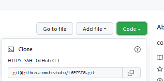
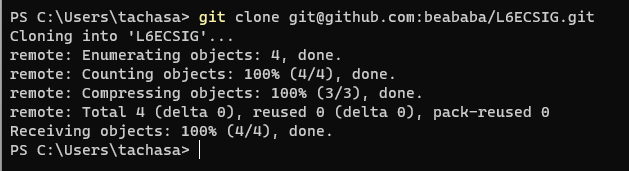

```{r setup, include=FALSE}
knitr::opts_chunk$set(echo = TRUE)
knitr::opts_chunk$set(cache = TRUE)
# Passer la valeur suivante à TRUE pour reproduire les extractions.
knitr::opts_chunk$set(eval = TRUE)
knitr::opts_chunk$set(warning = FALSE)
```

# Objet

Projet R, markdown et git (galère probable pour les clés SSH)

# Projet R et Markdown

## Interface Rstudio

4 fenêtres

## Créer un projet R

File / Nouveau projet

Le projet permet de conserver l'emplacement des fichiers.

Créer l'arborescence suivante


## Le markdown

Créer un markdown dans le répertoire script dans Rstudio, le knitter.


## paramétrage de la TOC et de l'execution des chunks


````
output: 
  html_document: 
    number_sections: yes
    toc: yes
editor_options: 
  chunk_output_type: console
````


source :

https://blog.wax-o.com/2014/04/tutoriel-un-guide-pour-bien-commencer-avec-markdown/


# Git

## Compte et projet

Créer un compte GIT et un projet


## Cloner le projet sur sa machine

cloner le projet sur son pc avec la commande *git clone* et le lien vers le répertoire





## Clés SSH

L'utilisation des clés permet d'éviter la saisie du mot de passe.

### Génération des clés

Pour pouvoir travailler ainsi, il faut avoir générer des clés

Ouvrir une fenêtre avec la commande cmd et saisir *ssh-keygen*

Le répertoire où la clé est créée est, par défaut, le répertoire utilisateur.
(afficher les fichiers cachés est nécessaire)


source :

https://www.lojiciels.com/comment-generer-des-cles-publiques-privees-ssh-sous-windows/


### Copie de la clé publique sur le serveur

Au niveau du github, coin haut droit *settings* puis *ssh keys*

Il s'agit de récupérer le contenu de la clé, la commande en ligne 

*clip < .ssh/id_rsa.pub*


(Sinon ouvrir le fichier et faire un copier - coller)


source :

https://docs.github.com/en/authentication/connecting-to-github-with-ssh/adding-a-new-ssh-key-to-your-github-account


### Test

* ssh -T git@github.com*


## Mise à jour du projet : 4 commandes à connaître


````
git pull
git add .
git commit -m "version finale veille cours"
git push
````

