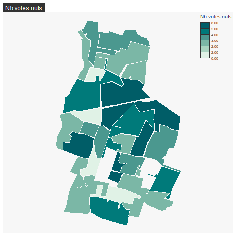
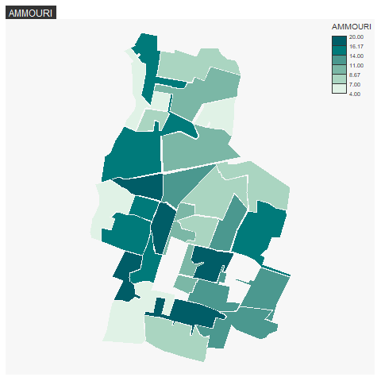
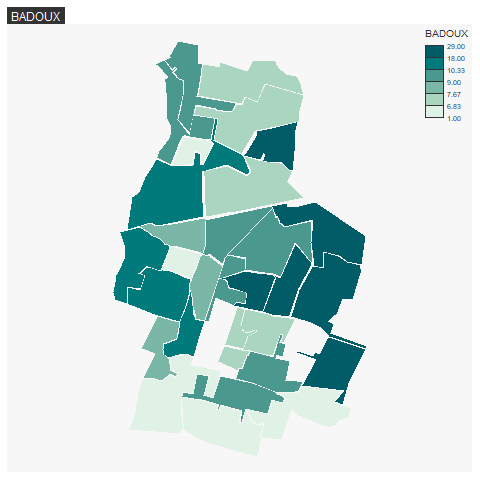

```{r setup, include=FALSE}
knitr::opts_chunk$set(echo = TRUE)
knitr::opts_chunk$set(cache = TRUE)
# Passer la valeur suivante à TRUE pour reproduire les extractions.
knitr::opts_chunk$set(eval = TRUE)
knitr::opts_chunk$set(warning = FALSE)
```

# Objet

R spatial avec la librairie sf (traitement des objets géographiques) et mapsf (cartographie)


sources :

- https://r-spatial.github.io/sf/

- https://riatelab.github.io/mapsf/

Ne pas oublier les cheat_sheet

- https://riatelab.github.io/mapsf/articles/web_only/cheat_sheet.html# Objets R spatiaux : le dataframe sf

- https://github.com/rstudio/cheatsheets/blob/main/sf.pdf

# Import


```{r}
library(sf)
zone <- st_read("data/vote.gpkg", "zone")
# quel contenu pour le fichier ?
str(zone)
```


# Indexation

Regarder l'indexation du dataframe dans la partie base R.
Sélectionner le premier bureau et l'afficher.
Quelle est la différence ?


```{r}
zone$numBureau
zone [zone$numBureau == 1,]
zone [1,2]
```


# Operations géométriques

Fusion des bureaux de votes, trouver la fonction et l'appliquer en s'inspirant de l'article 3 du github sf


```{r}
plot(zone$geom)
# première solution
fusion <- st_union(zone)
str(zone)
plot(zone$geom)
# deuxième solution
enveloppe <- st_convex_hull(fusion)
plot(enveloppe)
# troisième solution
tampon <- st_buffer(zone, 50)
plot(tampon$geom)
fusion <- st_union(tampon)
plot(fusion)
simplifier <- st_simplify(fusion,90, preserveTopology = F)
plot(simplifier)
```


# Première carte


```{r}
# carte avec commande rbase
plot(zone$geom, col = terrain.colors (31),
     border = NA,
     main = "31 bureaux de vote de Bondy")
# carte avec mapsf
library(mapsf)
mf_map(zone, type = "choro", border = NA,var = "aire")
# éliminer les bureaux 31 et 32
zone <- zone [zone$numBureau %in% seq(1,30),]
summary(zone)
mf_map(zone, type = "choro", pal = "Burg",
       border = NA, var = "txVotants")
```


# Jointure attributaire


Mettre un lien entre la cartographie et le fichier de résultat des élections

```{r}
data <- read.csv("data/bondyElection.csv", fileEncoding = "UTF-8", dec = ",")
```


## Les clés

```{r}
zone$Layer
data$Bureau.de.vote
```

### Comment recoder pour faire correspondre les clés ?

La clé des zones est de type : _Bureau *Num*
Celle des chiffres est de type : BV*Num*

Il faut donc recoder les valeurs.

Pour faire correspondre les deux clés, il suffit de retirer les lettres et garder uniquement les chiffres.

### Faire l'algo


- pour clé zone, extraire les deux derniers caractères

- pour clé chiffres, extraire à partir du 3e caractère

- vérifier si zone et chiffres correspondent

- supprimer les lignes en trop

- converir les clés en chiffres pour éviter le pb 01

- jointure attributaire zone et chiffres

- sauvegarder le résultat de la jointure

### Donner les fonctions R

- substring

- as.integer

- merge pour le jonction attributaire

### Faire le script

```{r}
dataSel <- data [c(1:32),]
zone$cle <- substring (zone$Layer,9,11)
dataSel$cle <- substring(dataSel$Bureau.de.vote, 3,5 )
dataSel$cle <- as.integer(dataSel$cle)
zone$cle <- as.integer(zone$cle)
length(zone$cle) == length(data$cle)
jointure <- merge(zone, dataSel, by = "cle")
st_write(jointure, "data/vote.gpkg", "jointure", delete_layer = T)
```


# Carte des résultats

```{r}
library(sf)
library(mapsf)
jointure <- st_read("data/vote.gpkg", "jointure", quiet = T)
names(jointure)
```

Il s'agit de cartographier le résultat des colonnes 6 à 18 sauf la colonne 7

## Algo

- tant que 6 < col < nb col - 1
  - si col différent de 7
    - faire 1 carte choroplèthe 
    - faire un titre 
- fin tant que

## Fonctions

- mf_map( type = choro )
- mf_title

## Carto


On extrait les noms des candidats

```{r}
names(jointure)[14:18] <- c("THOMASSIN", "HERVE", "AMMOURI", "DUGUET", "BADOUX")
```


```{r}
nomCol <- names(jointure)
col <- 6
for (col in 6:18) {
  if (col != 7) {   
    png(paste0("img/resultat", col, ".png"))
    mf_map (jointure, type = "choro", 
            border = NA, var = nomCol [col])
    mf_title(nomCol [col])
    dev.off()
    } else {col == 8}
}
```


Les images sont enregistrées une à une.









# Croiser grille INSEE et résultats des votes

Il s'agit de croiser résultats électoraux et carroyage de l'INSEE afin de confirmer une hypothèse.

Hypothèse : plus les gens sont modestes, plus ils votent la gauche.

On va illustrer cette hypothèse avec une carte combinant deux variables visuelles : taille et couleur.

La taille indiquera le nombre de votants, la couleur la densité des ménages pauvres.


## Préparation de la donnée


### Librairies et chargement des couches

```{r}
library(sf)
library(mapsf)
vote <- st_read("data/vote.gpkg", "jointure")
insee <- st_read("data/insee.gpkg", "bondy")
```


### Préparation des données


On filtre les colonnes et on calcule la densité de ménages pauvres.


```{r}
names(vote)[c(3,14)] <- c("bureau", "vote")
vote <- vote [, c("bureau", "vote")]
# Pour obtenir un chiffre relatif, on divise le nombre de ménages pauvres par le nombre de ménages total
insee$densite <- (insee$Men_pauv / insee$Men)*100
insee <- insee [, "densite"]
hist(insee$densite, main = "densité des ménages pauvres")
```

En général, sur Bondy, il y a 15-20 % de ménages pauvres.
Certains quartiers ont plus de 50 % de  ménages pauvres mais cela reste exceptionnel.


## Traitement

### Intersection

Afin de pouvoir croiser grille et polygone, il faut d'abord intersecter les deux de façon à récupérer le nom du bureau de vote pour chaque carreau de la grille.


```{r}
inter <- st_intersection(vote, insee)
summary(inter)
# la cartographie des multipolygones ne fonctionne pas, on passe tout en polygone
inter <- st_cast(inter, "POLYGON")
```


### Une première cartographie

```{r}
mf_export(inter, filename ="img/propchoroF.png", width = 1000, res = 200, expandBB = c(0,0,0,0.6))
mf_map(inter, col = "orange", border = "antiquewhite1")
mf_map(inter, type ="prop_choro", var = c("vote", "densite"), leg_pos = c("topright", "right"))
mf_layout("Euh...", credits = "INSEE / PV Electoral\nBondy, avril 2022")
dev.off()
```


Il est absurde de cartographier les résultats par carreau. Mais agréger les carreaux aux bureaux permettra d'avoir une carte lisible.


## Agrégation


Pour chaque bureau de vote, il faut calculer la somme de la densité des ménages pauvres.

On intersecte insee et bureaux, puis on calcule la densité ménages par rapport à la taille du carreau, puis on somme tous les carrés dans un bureau.

```{r}
# La taille du carroyage est normalement 200 *200
200*200
# taille du carré
st_area(inter)
st_area(insee)
# Il ne faut pas oublier les carreaux frontières...
# certains carreaux sont coupés par les limites des bureaux. la densité des ménages doit être rapportée à l'aire de la géométrie.
insee$aireTot <- st_area(insee)
inter <- st_intersection(vote, insee)
inter$nbRel <- (inter$densite * (st_area(inter)/ inter$aireTot) )
hist(inter$nbRel, main = "densité des ménages pauvres relatif à la taille des carreaux", xlab = "valeur de la densité", ylab = "nb d'occurence")
```

Ici, en utilisant la taille des morceaux de carreaux, on obtient beaucoup de zones avec une densité faible et quelques unes avec une grosse densité.


```{r}
# Enfin, on agrége les carreaux aux bureaux
agg <- aggregate (inter$nbRel , by = list(inter$bureau), sum )
names(agg) <- c("bureau", "sommeDensite")
#ré jointure
names(vote)
jointure <- merge(vote, agg, by = "bureau")
names(jointure)
jointure$densite <- round(jointure$densite,0)
jointure$densite
# Problème sur les unités m2, il faut s"en débarasser.
library(units)
jointure$densite <- drop_units(jointure$densite)
```

```{r}
mf_export(inter, filename ="img/propchoroT.png", width = 1000, res = 200, expandBB = c(0,0,0,0.8))
mf_map(jointure, col = "antiquewhite1", border = "grey")
mf_map(jointure, type ="prop_choro", var = c("vote", "densite"), border = NA, leg_pos = c("topright", "right"), leg_title = c("vote (nb)", "somme densité\npauvres (%)"))
mf_layout(title = "Les précaires votent à gauche", credits = "INSEE / PV électoral\nBondy, avril 2022")
dev.off()
```


