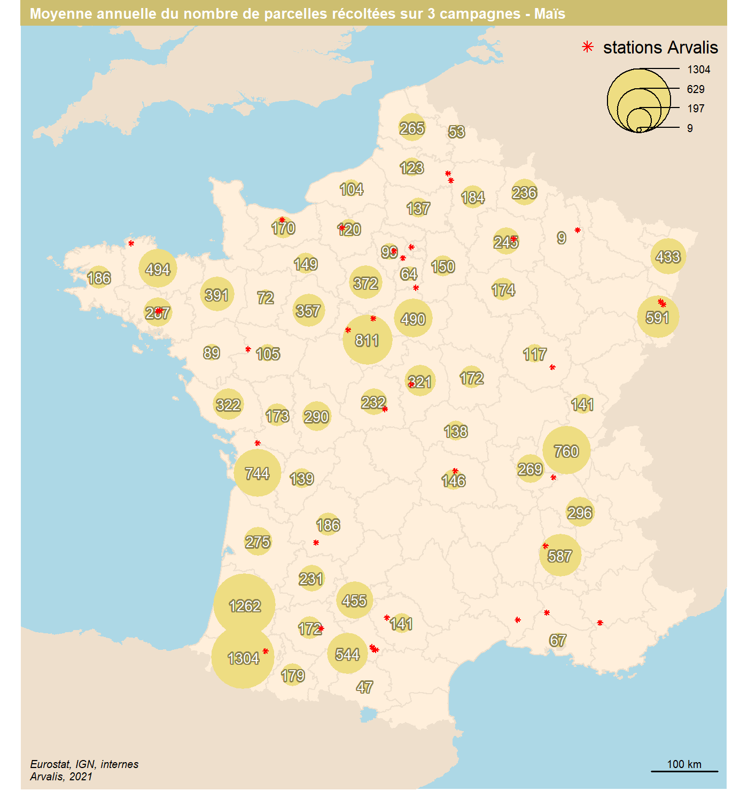
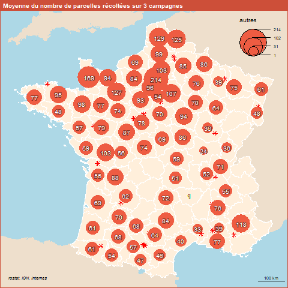

```{r setup, include=FALSE}
knitr::opts_chunk$set(echo = TRUE)
knitr::opts_chunk$set(cache = TRUE)
# Passer la valeur suivante à TRUE pour reproduire les extractions.
knitr::opts_chunk$set(eval = TRUE)
knitr::opts_chunk$set(warning = FALSE)
```

# Cadre

## Objet

Dans le cadre de la priorisation des achats de machine, faire 3 cartes :

- diagrammes sur culture concernée maïs ou autres

- moyenne des parcelles par département en mais et autres cultures


## Librairies et répertoire

```{r}
library(sf)
library(cartography)
```

# Données

```{r}
dpt <- st_read("../DATA/ign.gpkg", "dpt", quiet = TRUE, stringsAsFactors = F)
data <- read.csv2("data/data.csv")
fond <- st_read("../DATA/nuts.shp", quiet = TRUE)
fond <- st_transform(fond, 2154)
stations <- st_read("../DATA/station.shp")
```

# Traitements


## Recodage maïs et autres

```{r}
table(data$ESPECE, useNA = "always")
mais <- c("MAIS FOURRAGE", "MAIS GRAIN", "MAIS SEMENCES")
data$categ [data$ESPECE %in% mais] <-  "Maïs"
data$categ [!(data$ESPECE %in% mais)] <-  "Autres cultures"
table(data$categ, useNA = "always")
```

## Agregation par département et par an (moyenne des trois années)

```{r}
agg <- aggregate(data$NB_PARCELLE..rdt15., by = list(data$ID_DEPARTEMENT, data$DEPARTEMENT, data$categ, data$ANNEE ), sum)
names(agg) <- c("NUM_dept", "NOM_DPT", "CATEGORIE", "annee", "somme")
agg2 <- aggregate(agg [, "somme"], by = list(agg$NUM_dept, agg$NOM_DPT, agg$CATEGORIE), mean)
names(agg2) <- c("NUM_dept", "NOM_DPT", "CATEGORIE", "moyenne")
agg2$moyenne <- round(agg2$moyenne,0)
```

## Jointure

```{r}
data <- merge(agg2, dpt [, c("NUM_dept")], by = "NUM_dept")
dataSansGeom <- data [, ,drop = TRUE]
write.csv(dataSansGeom, "data/final.csv")
```

# Cartographie

## Mise en forme, par département, maïs et autres cultures

```{r}
data$mais <- ifelse(data$CATEGORIE == "Maïs", data$moyenne, 0)
data$autres <- ifelse(data$CATEGORIE == "Autres cultures", data$moyenne, 0)
agg <- aggregate (data [,c("mais", "autres"), drop = TRUE], by = list(data$NUM_dept), FUN = sum)
names(agg)[1] <- c("NUM_dept")
data <- merge(agg, dpt [,c("NOM_DEP", "NUM_dept")], by = "NUM_dept")
data <- st_as_sf(data)
stations$var <- 1
```

## Cartes

```{r}
sizes <- getFigDim(dpt, width = 1400, res = 200)
png("img/mais.png", width = 1400, height = sizes [2],res = 200)
par(mar = c(0.8,1,1.2,1))

ghostLayer(dpt, bg = "lightblue")
plot(fond$geometry, col = "antiquewhite2", border = NA, add = TRUE)
plot(dpt$geom, col = "antiquewhite1", border = "antiquewhite2", add = TRUE)


propSymbolsLayer(data, var = "mais", border = NA, col = "lightgoldenrod" ,legend.title.txt = "",
                 legend.pos = "topright", add = TRUE)
data$lmais <- ifelse(data$mais == 0, NA, round(data$mais,0))
data$lmais
labelLayer(data, txt = "lmais", halo = 0.5, bg = "lightgoldenrod4", cex = 0.8, col = "white")
plot(stations, pch = 8, cex = 0.5,col = "red", add = TRUE)
legend("topright", bty = "n",pch = 8, col = "red", legend = "stations Arvalis")
layoutLayer("Moyenne annuelle du nombre de parcelles récoltées sur 3 campagnes - Maïs", author = "Arvalis, 2021",
            sources = "Eurostat, IGN, internes", col = "lightgoldenrod3", frame = FALSE)
dev.off()

```




```{r}
sizes <- getFigDim(dpt, width = 1400, res = 200)
png("img/autre.png", width = 1400, height = sizes [2],res = 200)
par(mar = c(0.8,1,1.2,1))
ghostLayer(dpt, bg = "lightblue")
plot(fond$geometry, col = "antiquewhite2", border = NA, add = TRUE)
plot(dpt$geom, col = "antiquewhite1", border = "antiquewhite2", add = TRUE)
#waffleLayer(data, var = c( "mais", "autres"), cellvalue = 20, cellsize = 1, 
        #    cellrnd = "ceiling", ncols = 6, col = c("tomato1","lightblue"), 
 #           add = TRUE)
data$autres [data$autres == 0] <- NA
propSymbolsLayer(data, var = "autres", border = NA, col = "springgreen" , legend.title.txt = "",
                 legend.pos = "topright", add = TRUE)
data$lautre <- round(data$autres,0)
labelLayer(data, txt = "lautre", halo = 0.5, bg = "springgreen4", cex = 1, col = "white")
plot(stations, pch = 8, cex= 0.5, col = "red", add = TRUE)
legend("topright", bty = "n",pch = 8, col = "red", legend = "stations Arvalis")
layoutLayer("Moyenne annuelle du nombre de parcelles récoltées sur 3 campagnes - Autres cultures", author = "Arvalis, 2021",
            sources = "Eurostat, IGN, internes", col = "springgreen3", frame = FALSE)
dev.off()
```



```{r}
sizes <- getFigDim(dpt, width = 1400, res = 200)
png("img/rapport.png", width = 1400, height = sizes [2],res = 200)
par(mar = c(0.8,1,1.2,1))
ghostLayer(dpt, bg = "lightblue")
plot(fond$geometry, col = "antiquewhite2", border = NA, add = TRUE)
plot(dpt$geom, col = "antiquewhite1", border = "antiquewhite2", add = TRUE)
data$tot <-  data$mais + data$autres
# une même taille pour légende et symboles carte
# on trace sur le total, le 2e item
taille <- 0.6
propSymbolsLayer(data, var = "tot", symbols = "bar", border = "grey", add = T, legend.pos = "n", col = "springgreen", inches =  taille)
propSymbolsLayer(data, var = "mais", col = "lightgoldenrod", symbols = "bar",
                 border = "grey" , add = T,  legend.pos = "o", inches = taille)
legendBarsSymbols("left", var = c(min(data$tot,na.rm = TRUE), max(data$tot,na.rm = TRUE)), inches = taille, col = "lightblue", title.txt = "nb parcelles \nmoyenne annuelle")
legendTypo("topright", col = c("lightgoldenrod","springgreen"), categ = c("mais", "autres culture"), title.txt = "",  nodata = F)
plot(stations, pch = 8, cex= 0.5, col = "red", add = TRUE)
legend("topright", bty = "n",pch = 8, col = "red", legend = "stations Arvalis")
layoutLayer(title = "Mais et autres cultures",theme = "blue.pal", posscale = "bottomright", sources = "Eurostat, IGN, internes", author = "Arvalis, 2021")
dev.off()
```


## Essai en waffle

```{r}
summary(data)
data$autres [is.na(data$autres)] <- 0
ghostLayer(dpt, bg = "lightblue")
plot(fond$geometry, col = "antiquewhite2", border = NA, add = TRUE)
plot(dpt$geom, col = "antiquewhite1", border = "antiquewhite2", add = TRUE)
waffleLayer(x = data, var = c( "mais", "autres"), cellvalue = 200, cellsize = 400, 
             cellrnd = "ceiling",
  celltxt = "1 cellule represente 100 parcelles",
  labels = c("Mais", "
             autres cultures"),
  ncols = 4,
  col = c("tomato1", "lightblue"),
  border = "#f2efe9",
  legend.pos = "topright",
  legend.title.cex = 1,
  legend.title.txt = "Mais et autres cultures",
  legend.values.cex = 0.8,
          add = TRUE)
```


```{r}
library(sf)
mtq <- st_read(system.file("gpkg/mtq.gpkg", package = "cartography"),
               quiet = TRUE)
# number of employed persons
mtq$EMP <- mtq$ACT - mtq$CHOM
summary(mtq)
str(mtq)
str(data)
plot(st_geometry(mtq),
     col = "#f2efe9",
     border = "#b38e43",
     lwd = 0.5)
waffleLayer(
  x = mtq,
  var = c("EMP", "CHOM"),
  cellvalue = 100,
  cellsize = 400,
  cellrnd = "ceiling",
  celltxt = "1 cell represents 100 persons",
  labels = c("Employed", "Unemployed"),
  ncols = 6,
  col = c("tomato1", "lightblue"),
  border = "#f2efe9",
  legend.pos = "topright",
  legend.title.cex = 1,
  legend.title.txt = "Active Population",
  legend.values.cex = 0.8,
  add = TRUE
)

layoutLayer(
  title = "Structure of the Active Population",
  col = "tomato4",
  tabtitle = TRUE,
  scale = FALSE,
  sources =  paste0("cartography ", packageVersion("cartography")),
  author = "Sources: Insee and IGN, 2018",
)


```

