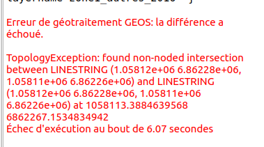
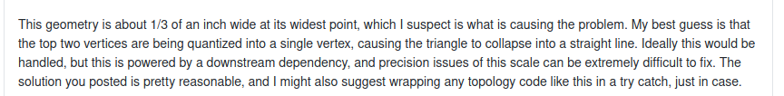

```{r setup, include=FALSE}
knitr::opts_chunk$set(echo = TRUE)
knitr::opts_chunk$set(cache = TRUE)
# Passer la valeur suivante à TRUE pour reproduire les extractions.
knitr::opts_chunk$set(eval = TRUE)
knitr::opts_chunk$set(warning = FALSE)
```

# Cadre

## Objet

Paramètres à estimer à partir fichiers rpg sur plusieurs années pour 4 zones de l'Alsace

- taille moyenne parcelles
- SAU moyenne
- surface moyenne mais
- idem mais en monoculture
- idem mais 1e fois

difficulté : identifiant différent


Remarque : la démarche

## Librairies et répertoire

```{r}
library(sf)
# Linking to GEOS 3.8.0, GDAL 3.0.4, PROJ 6.3.1
library(lwgeom) # pour la validation de la géométrie
library(cartography)
library(units) # pour le pb des unités des aires. on supprime.
library(tictoc) # mesure des opérations géométriques st_union
```

## Données

### Générales

```{r}
# communes sans la corse
commune <- st_read("../dataE/00_ADMIN/ign.gpkg", "commune", quiet = TRUE,stringsAsFactors = F)
dpt <- st_read("../dataE/00_ADMIN/ign.gpkg", "dpt", quiet = TRUE, stringsAsFactors = F)
canton2015 <- st_read("../dataE/00_ADMIN/canton2015/CANTON.SHP")
fond <- st_read("../dataE/00_ADMIN/nuts.gpkg", "pays", quiet = TRUE, stringsAsFactors =F)
```


### Le rpg

2 départements concernés : Haut et Bas Rhin. Récupération sur le site de la draaf
https://draaf.grand-est.agriculture.gouv.fr/RPG,2162
https://draaf.grand-est.agriculture.gouv.fr/RPG,2161

4 années (2015 à 2018)


```{r, eval=FALSE}
# rpg dezipage
chemin <-"../dataE/01_CULTURES/rpg/"
noms <- list.files(chemin)
for (i in 1:length(noms)){
  unzip(zipfile =  paste0(chemin,noms[i]), exdir = chemin)
}
# assemblage
noms <- list.files(chemin, pattern = ".shp")
data <- NULL
i <- 1
for (i in 1:length(noms)){
  tmp <- st_read(paste0(chemin, noms [i]))
  tmp$an <- substring(noms [i],9,12)
  data <- rbind(data,tmp)
}
# Enregistrement en format .gpkg 972 363
rpg <- data [,c("Code_cultu", "an"), drop = FALSE]
st_write(rpg, "../dataS/chrysomele.gpkg", "rpg", row.names = FALSE,quiet = TRUE, delete_layer = TRUE)
```


#### Exploration rpg 

##### Remarque : suppression des unités m2

Les calculs d'aire génèrent automatiquement l'utilisation de la bibliothèque units.
Pour simplifier, on supprime l'unité.

```{r}
library("units")
drop_units(rpg)
```


##### Nombre d'occurences

```{r}
rpg <- st_read("../dataS/chrysomele.gpkg", "rpg", quiet = TRUE)
tab <- addmargins(table(rpg$Code_cultu, rpg$an))
knitr::kable(tab)
```


##### Taille moyenne des parcelles agricole

```{r, eval = TRUE}
# rpg <- st_read("../dataS/chrysomele.gpkg", "rpg", quiet = TRUE, stringsAsFactors = FALSE)
calcul <- function(data) {
  aire <- (sum(st_area(data))/10000)/10000
  # résultat en milliers d'ha
  moyenne <-(sum(st_area(data)) / nrow(data))/10000
  res <- c(aire, moyenne)
  } 
# liste
lrpg <- split(rpg, rpg$an)
names(lrpg) <- c("rpg2015", "rpg2016", "rpg2017", "rpg2018")
ttsCultures <- sapply(lrpg,calcul)
# uniquement mais 275 234 obs
rpgMais <- rpg [rpg$Code_cultu %in% c("MID", "MIE", "MIS"), ]
st_write(rpgMais, "../dataS/chrysomele.gpkg", "rpgMais", quiet = TRUE, delete_layer = TRUE)
# liste
lrpgMais <- split(rpgMais, rpgMais$an)
names(lrpgMais) <- c("rpg2015", "rpg2016", "rpg2017", "rpg2018")
mais <- sapply(lrpgMais, calcul)
# assemblage et moyenne
total <- rbind(ttsCultures, mais)
moyenne <- apply(total,1, mean)
total <- cbind(total, moyenne)
rownames(total) <-  c("tts total", "tts moy", "mais total", "mais moy")
knitr::kable(total, digits = 1, caption = "Aires moyennes et totales (en milliers ha) toutes cultures et mais - RPG 2019")
```


### Zones d'étude

Les cantons d'Alsace sont réparties en 4 zones. Il s'agit des cantons d'avant 2015.

```{r, eval = FALSE}
alsace <- read.csv2("../dataE/00_ADMIN/alsace.csv")
names(alsace) <- c("zone", "PR", "nom", "CODE_CANTO")
canton2012 <- st_read("../dataE/00_ADMIN/canton2012/CANTON.SHP", quiet = TRUE, stringsAsFactors = TRUE)
str(alsace)
str(canton2012)
cantonS <- canton2015 [ canton2015$NOM_REG == "ALSACE",]
alsace.sf <- merge (cantonS, alsace, by = "CODE_CANTO")
alsace.sf <- alsace.sf [, c("CODE_CANTO", "ID_GEOFLA","zone", "PR", "nom" ),]
# cantonAlsace sera utilisé
st_write(alsace.sf, "../dataS/chrysomele.gpkg", "cantonAlsace", quiet = TRUE, delete_layer = TRUE)
```

## Préparation des données


### Intersection zones et rpg


Les données du RPG, même pour une seule région, sont très lourdes et le R de base 
les manipule mal.

La solution est d'éclater les fichiers selon des zones géographiques et les années.

Il faut donc intersecter la zone d'étude et le rpg.

```{r}
alsace <- st_read("../dataS/chrysomele.gpkg", "cantonAlsace", quiet = TRUE, stringsAsFactors = FALSE)
rpg <- st_read("../dataS/chrysomele.gpkg", "rpgMais", quiet = TRUE, stringsAsFactors = FALSE)
# 275 324 obs
# agrégation par zones
aggAlsace <- aggregate(alsace [,c("zone"), drop = FALSE], by = list (alsace$zone), length)
names(aggAlsace)[1:2] <- c("groupe", "nb")
png("../img/alsace.png")
par(mar=c(0,0,1.2,0))
ghostLayer(aggAlsace, bg = "lightblue1")
plot(fond, col = "antiquewhite3", border = NA, add = TRUE)
plot(dpt$geom, add = TRUE, col = "antiquewhite2", border = NA)
plot(aggAlsace$geometry, col = "antiquewhite1", border = "grey", add= TRUE)
labelLayer(aggAlsace, txt = "groupe", halo = 2 )
layoutLayer(title = "Zones d'étude Alsace")
dev.off()
# intersection très couteuse. géométrie du rpg nécessite de forcer la validité
inter <- st_intersection(st_make_valid(rpg), aggAlsace)
# modification du nom de la 4e zone
table(inter$groupe)
inter$groupe [inter$groupe == "côté Lorrain"] <- 4
# On travaillera à partir de ce fichier désormais.
st_write(inter, "../dataS/chrysomele.gpkg", "inter", quiet = TRUE, delete_layer = TRUE)
#  275 985
```


TODO Attention zone Strasbourg absente ?


### Nettoyage de la donnée spatiale

Le but est d'obtenir uniquement des polygones afin d'éviter les erreurs topologiques dans les fonctions d'intersection.

TODO vérfier par rapport aux aires totales


```{r}
inter <- st_read("../dataS/chrysomele.gpkg", "inter", quiet = TRUE, stringsAsFactors = FALSE)
# 207 734 Nettoyer les géométries, c'est supprimer les geometrycollection, n'avoir que des polygones.
nettoyerGeom <- function (df) {
  df <-df [st_geometry_type(df) != "GEOMETRYCOLLECTION",]
  dfvalid <- st_make_valid(df)
  dfpoly <- st_cast(dfvalid, "POLYGON")
}

# Supprimer les petits polygones, ceux qui sont milieu 1e classe
# à n'utiliser que si pb topologique... et même la
supprimer <- function (df) {
  df <- st_as_sf(df)
  df$aire <- drop_units(st_area(df) /10000)
  bks <- getBreaks(df$aire, nclass = 8, method ="fisher")
  df <- df [df$aire > bks [2]/2,]
  }

# Fusionner les parcelles adjacentes : union de tous les polygones, puis éclatement
polygoner <- function(df) {
  dfunion <- st_union(df)
  dfpoly <- st_cast(dfunion, "POLYGON")
}


# Eclater les zones et les années, car on va travailler sur la géométrie.
eclater <- function (num) {
 df <- lzone[[num]]
 ldf <- split (df, df$an)
}
# de 207 334 à 207 018
inter <- nettoyerGeom(inter)
summary(inter$geom)
lzone <- split(inter, inter$groupe)
# boucle sur les zones
i <- 1
noms <- c("lzone1", "lzone2", "lzone3","lzone4")
for (i in 1:4){
  # on imbrique et on nomme
    assign(noms [i], lapply(eclater (i),polygoner))
}

# 90 / 27 / 39 et 2 M°
# enregistrement en fichiers pour qgis
enregistrer <- function(df, num) {
  #  on récupère le nom de la zone et l'année sur le df même
  zone <- substring(deparse(substitute(df)),2,6)
  st_write(df, dsn = "../dataS/chrysomelexport.gpkg", 
           layer = paste0(zone,"_", num), quiet = TRUE, delete_layer = TRUE)
}
for (i in 1:4){
enregistrer(lzone1 [[i]],i)
}
for (i in 1:4){
enregistrer(lzone2 [[i]],i)
}
for (i in 1:4){
enregistrer(lzone3 [[i]],i)
}
for (i in 1:4){
enregistrer(lzone4 [[i]],i)
}
# pour utiliser lapply, on imbrique les listes de zone dans une liste (cet objet
# est différent du lzone)
limbrique <- list(lzone1, lzone2, lzone3, lzone4)
```


Allègement pour fin de test

```{r}
leger2 <- lapply(lzone2, supprimer)
# 24 M°OK
# 17 M° OK
```


# Fonctions permettant d'extraire les objets spatiaux prêts à l'emploi


## Rappel méthode : point sur opérateurs spatiaux


Par ailleurs, on utilise des lapply

## Uniquement le maïs sur les 4 ans

Sur 4 ans, les carreaux maïs et rien d'autre. C'est l'intersection de toutes les années.
Fonction récursive.

```{r}
uniquementCulture <- function(l) {
  f <- length (l)
  i <- 2
  prem <- st_intersection(l[[i-1]], l [[i]])
  for (i in 2:(f-1)){
    inter <- st_intersection(prem, l[[i+1]])
  }
  aire <- round(sum(st_area(inter))/10000,2)
  aire <- drop_units(aire)
  return(aire)
}
# test sur petite zone
res <- UniquementCulture(lzone4)
library("units")
res <-  drop_units(res)
# test sur la liste imbrique
sapply(limbrique,uniquementCulture)
# stockage du résultat
maisUnique <- c(41062.10 , 8854.05 , 8628.70 ,  158.15)
```


## Uniquement mais sur une année


On crée une fonction ayant pour paramètre l'année de la demande.

```{r, eval=TRUE}
lunion <- lzone2
num <- 1
anneeUnique <- function(lunion, num) {
  X <- st_union(lunion [[num]] ) %>% st_set_precision(10000) %>% st_make_valid()
  lreste <- lunion
  lreste [[num]] <- NULL
  # on unit les 3 années. mais le st_union fait produit cartésien. il faut d'abord
  # créer une seule table
  tot <- NULL
  for (i in 1:3) {
    g <- lreste[[i]][, 1, drop = TRUE]
    tot <- c(tot,g)
  }
  # objet sf et crs
  tot <- st_as_sf(st_as_sfc(tot))
  st_crs(tot) <- 2154
  Y <- st_union(tot) %>% st_set_precision(1000000) %>% st_make_valid()
  res <- st_difference(X, Y)
  res <-round(st_area(res)/10000,0)
  res <- drop_units(res)
}
```


```{r, eval=TRUE}
# test sur petite zone
# le Y est à 227 M ° puis 
tic()
tot <- NULL
for (i in 1:4) {
  res <- anneeUnique(lzone4,i)
  tot <- c(tot,res)
}
toc()
tic()
res <- sapply(1:1, function(i){anneeUnique(lzone1,i)})
toc()
# 581 s , 5 600s
res
reszone2 <- c(2044, 1054  ,927, 1135)
reszone3 <- c(2183, 1731, 1532, 1387)
# pour la 1 14558 erreur, on enlève deux zéros sur la précision

```


parallélisation

```{r, eval=TRUE}

library(parallel)
detectCores()
cl <- makeCluster(4)


result <- parSapply(cl, 1:4, function(x)x+2)
result

tic()
result <- parSapply(cl,1:4, function(i){
  lunion <- lzone4
  X <- st_union(lunion [[num]] ) %>% st_set_precision(1000000) %>% st_make_valid()
  lreste <- lunion
  lreste [[num]] <- NULL
  # on unit les 3 années. mais le st_union fait produit cartésien. il faut d'abord
  # créer une seule table
  tot <- NULL
  for (i in 1:3) {
    g <- lreste[[i]][, 1, drop = TRUE]
    tot <- c(tot,g)
  }
  # objet sf et crs
  tot <- st_as_sf(st_as_sfc(tot))
  st_crs(tot) <- 2154
  Y <- st_union(tot) %>% st_set_precision(1000000) %>% st_make_valid()
  res <- st_difference(X, Y)
  res <-round(st_area(res)/10000,0)
  res <- drop_units(res)
})
stopCluster(cl)
toc()


```

```{r}


tot
zone4anneUnique <- c(691,  773 ,1019 , 804)
# 2 mn pour une zone de 2.4  77 s
tic()
tot <- NULL
for (i in 1:4) {
  res <- anneeUnique(lzone2,i)
  tot <- c(tot,res)
}
toc()
# zone de 27 M° 1135
zone2anneeUnique <- c( 2044, 1054,  927, 1135)

tic()
tot <- NULL
for (i in 1:4) {
  res <- anneeUnique(lzone3,i)
  tot <- c(tot,res)
}
toc()

```


## Deux ans sur les quatre ans

Intersection des années et différence entre les deux géométries créées
Directement en fonction

```{r, eval=TRUE}
deuxAns <- function (num1,num2, lunion) {
  X <- st_union(lunion [[num1]], lunion [[num2]])
  lreste <-lunion [c(-num1,-num2)]
  Y <- st_union (lreste [[1]], lreste [[2]])
  # Toutes les géométries de X qui ne sont pas dans Y
  res <- 
    st_cast(st_difference(X,Y ), "MULTIPOLYGON")
  res2 <- sapply(st_as_sf(res), st_area)
  indice <- which(round(res2,0) > 500)
  #plot(res2 [indice], main = "retenu")
  res3 <- round(res2 [indice],0)
  return(res3)
}
```


## trois ans sur les quatre ans

 Surface cultivé 3 ans et sans mais sur une année unique
union des 3 ans et différence avec l'année cultivé


```{r, eval=TRUE}
troisAns <- function (lunion, num) {
  Y <- lunion [[num]]
  lreste <- lunion [[-num]]
  X <- st_union(lreste [[1]], lreste [[2]], lreste [[3]])
  diff <- st_difference(X,Y)
  round(st_area(diff)/10000,0)
}

```

Les fonctions ne peuvent utiliser de gros jeux de données, le pb identifié est le
st_difference 
  - nécessité de faire un st_union (le poids des fichiers +++)
  - opération lourde
  
TODO préparer mail CNRS pour voir si solution

# Nouvelle méthode : R + QGIS

On enregistre les fichiers nécessaires sans utiliser et on fait la différence sous QGIS.
Puis on importe les résultats dans R a afin de faire les tableaux.
Du coup, on transforme les 3 fonctions (la première avec les st_intersection rend un résultat)
Au lieu d'utiliser les listes, il est plus simple de repartir de la base.


## annee unique

```{r}
df <- zone2
num <- 1
# plus simple de repartir d'inter !
enregistrerAnneeUnique <- function(df, num) {
  # récupération du nom pour nommer le fichier, df reste l'objet
  nomZone <-  df$groupe [1]
  an <-  c("2015", "2016","2017","2018")
  X <- df [df$an == an [num] , ]
  Y <- df [df$an !=  an [num],]
  # obligation d'enregistrer dans des gpkg sinon qgis ne les voit pas
  nomgpkg <- paste0("../dataS/chrysomelexport",nomZone,".gpkg")
  st_write(X, dsn = nomgpkg, layer = paste0(nomZone,"_", an[num]), quiet = TRUE, delete_layer = TRUE)
  st_write(Y, dsn = nomgpkg, layer = paste0(nomZone,"_autres_", an [num]), quiet = TRUE, delete_layer = TRUE)
}
```


Enregistrement des données pour Qgis

Pour chaque année, deux couches, celle de l'année X et celle de toutes les années Y.

```{r}
#boucle pour les zones
i <- 1
for (i in 1:4) {
  df <-  inter [inter$groupe == i,] 
  j <- 1
    # boucle pour les années
  for (j in 1:4) {
    enregistrerAnneeUnique(df, j)
  }
}
```


On récupère la couche de différence

```{r, eval = TRUE}
couche <- c("2015", "2016", "2017", "2018")
total <- NULL
i <- 1
for (i in 1:4) {
  diff <-
    st_read("../dataS/chrysomelediff.gpkg",
            layer = couche [i],
            quiet = TRUE)
    total <- rbind(total,sum(st_area(diff)))
}
rownames(total) <- couche
colnames(total) <- "zone1"
total <- round(total/10000,0)
# total des différences années et autres années (aires en ha)
total
```

TODO 2016 et 17 ne passent pas sous Qgis, sans doute pour un pb de polygone trop petit provoquant une 
erreur de topologie. 




....et l'explication




reférence : https://github.com/Turfjs/turf/issues/1575

Donc supprimer les polygones trop petits, faire sous Qgis
... Et vérifier que cela ne passe pas sous R (voir st_make_valid, st_valid et st_geometry_type)

TODO macro R sous Qgis pour éviter les AR voire python

Nettoyage couche chrysomele

```{r}
library(rgdal)
ogrListLayers("../dataS/chrysomele.gpkg")
```


gestion d'erreur

```{r}
print(try(log("a"), TRUE))
log("a")
res <- lapply (c(1, "a",2), function (i) try(log(i), TRUE) )
res
```

## Deux ans


```{r, eval=TRUE}
enregistrerDeuxAns <- function (df) {
  nomZone <-  df$groupe [1]
  print(nomZone)
  # choix des paires dans 4 elements
  nb <- 2
  els <- seq (1:4)
  i <- 2
  for (i in 2:4) {
    paire <- c(1, i)
    nomPaire <- paste0(paire[1], paire[2])
    print (nomPaire)
    an <-  c("2015", "2016", "2017", "2018")
    X <- df   [df$an %in% an[paire], ]
    Y <- df [!df$an %in% an[paire], ]
    nomgpkg <-
      paste0("../dataS/chrysomelexportDeux", nomZone, ".gpkg")
    st_write(
      X,
      dsn = nomgpkg,
      layer = paste0(nomZone, "_", nomPaire),
      quiet = TRUE,
      delete_layer = TRUE
    )
    st_write(
      Y,
      dsn = nomgpkg,
      layer = paste0(nomZone, "_autres_", nomPaire),
      quiet = TRUE,
      delete_layer = TRUE
    )
  }
  
}


# sur chaque zone
for (i in 1:4) {
  enregistrerDeuxAns(inter [inter$groupe == i,])
}

```


## Trois ans

```{r}
enregistrerTroisAns <- function (df) {
  nomZone <-  df$groupe [1]
  print(nomZone)
  # choix des paires dans 4 elements
  els <- seq (1:4)
  i <- 1
  for (i in 1:4) {
    nbY <- i 
    nbX <- els [-i]
    nomX <- paste0(nbX[1],nbX[2], nbX[3])
    an <-  c("2015", "2016", "2017", "2018")
    an [nbX]
    X <- df   [df$an %in% an[nbX], ]
    Y <- df [df$an %in% an[nbY], ]
    nomgpkg <-
      paste0("../dataS/chrysomelexportTrois", nomZone, ".gpkg")
    st_write(
      X,
      dsn = nomgpkg,
      layer = paste0(nomZone, "_", nomX),
      quiet = TRUE,
      delete_layer = TRUE
    )
    st_write(
      Y,
      dsn = nomgpkg,
      layer = paste0(nomZone, "_autres_", nomX),
      quiet = TRUE,
      delete_layer = TRUE
    )
  }
  
}

# sur chaque zone
for (i in 1:4) {
  enregistrerTroisAns(inter [inter$groupe == i,])
  }
```


# Extraction 3 ans

```{r, eval = TRUE}
total <- NULL
totalZone <- NULL
noms <- NULL
i <- 1
#parcours des zones
for (i in 1:4) {
 print(i)
  # parcours des années
  for (j in c(123,124,134,234)){
  nomfic <- paste0("../dataS/chrysomelediff", i,"_",j, ".gpkg")
  nomcouche <- paste0("chrysomelediff", i,"_",j)
  diff <-
    st_read(nomfic,
            layer = nomcouche,
            quiet = TRUE)
    total <- rbind(total,sum(st_area(diff)))
  }
   colnames(total) <- i
   total <- round(total/10000,0)
   totalZone <-  cbind(totalZone, total)
   total <- NULL
}
rownames(totalZone) <- c(123,124,134,234)

# total des différences années et autres années (aires en ha)
totalZoneTrois <- totalZone
```

# Extraction 2 ans


```{r, eval = TRUE}
total <- NULL
totalZone <- NULL
noms <- NULL
i <- 1
#parcours des zones
for (i in 1:4) {
 print(i)
  # parcours des années
  for (j in c(12,13,14)){
  nomfic <- paste0("../dataS/chrysomelediff", i,"_",j, ".gpkg")
  nomcouche <- paste0("chrysomelediff", i,"_",j)
  diff <-
    st_read(nomfic,
            layer = nomcouche,
            quiet = TRUE)
    total <- rbind(total,sum(st_area(diff)))
  }
   colnames(total) <- i
   total <- round(total/10000,0)
   totalZone <-  cbind(totalZone, total)
   total <- NULL
}
rownames(totalZone) <- c(12,13,14)

# total des différences années et autres années (aires en ha)
totalZonedeux <- totalZone
```

