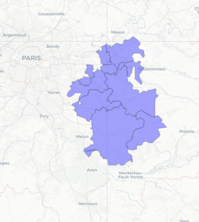
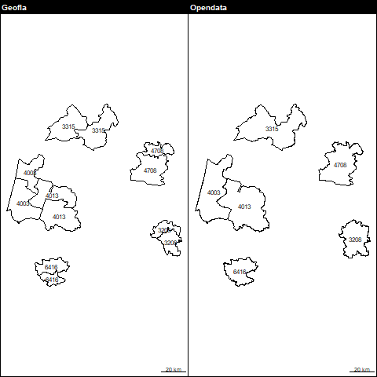
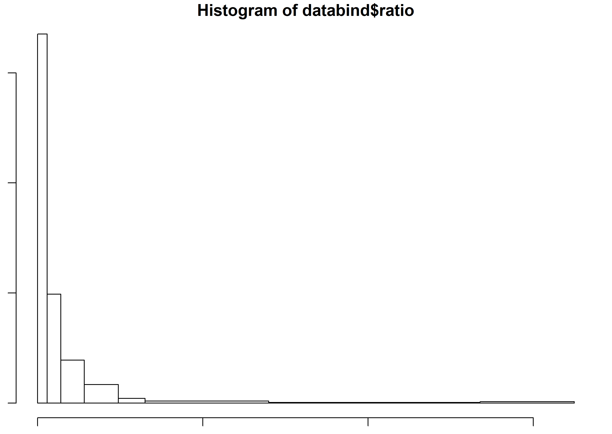

```{r setup, include=FALSE}
knitr::opts_chunk$set(echo = TRUE)
knitr::opts_chunk$set(cache = TRUE)
# Passer la valeur suivante à TRUE pour reproduire les extractions.
knitr::opts_chunk$set(eval = TRUE)
knitr::opts_chunk$set(warning = FALSE)
```

# Cadre

## Objet

Créer trois cartes issues de deux bases de données différentes :
- mais semence (Enquêtes AGPM Maïs Semence 2019)
- mais doux (rpg 2019)
et une carte de ratio doux / semence

Ce projet permet de faire le point sur les différentes sources pour les cantons. 
En effet, dans les fichiers geofla, c'est l'identifiant geofla qui est unique et
le nom du canton n'apparaît pas.
Le code canton est constitué du numéro de département et du code canton n'est pas unique.
Le nom du chef lieu n'est pas toujours présent.

Un fichier récupéré sur datagouv, produit par l'IGN, ne comporte pas l'id geofla mais a un nom canton.
Remarque ce fichier date de 2015 également, les ID de canton (num dpt et code canton sont uniques) https://www.data.gouv.fr/fr/datasets/decoupage-des-cantons-pour-les-elections-departementales-de-mars-2015/ 
droits : "IGN"

Comme il s'agit de faire correspondre les données de deux régions uniquement (Nouvelle
Aquitaine et Occitanie, voire même plutôt des anciennes régions puisque les données de la géométrie des cantons
datent de 2015 Aquitaine et Midi pyrénées), la technique choisie
est d'associer les fichiers géométries de canton utilisées avec le rpg 2019 (geofla 2015)
par l'id canton et à traiter au cas par cas les doublons (jointure attributaire pas d'intersection
spatiale)


## Librairies
I
```{r}
library("sf")
library("mapview") # pour exploration de la donnée
library("cartography")
```


## Données

```{r}
cantonGeofla <- st_read("../dataE/00_ADMIN/canton2015/CANTON.SHP", quiet = TRUE, stringsAsFactors = F)
cantonOpenData <- st_read("../dataE/00_ADMIN/canton2015opendata/Cantons_2015_WGS4G.shp",
                          options = "ENCODING=WINDOWS-1252",quiet = T, stringsAsFactors =F)
# fond européen pour représenter voisinage géographique des deux régions
fond <-  st_read("../dataE/00_ADMIN/nuts.gpkg", "pays")
fond <- st_transform(fond, 2154)
st_crs(fond)
fondRegion <- st_read("../dataE/00_ADMIN/ign.gpkg", "region")
fondRegion <- st_transform(fondRegion,2154)
st_crs(fondRegion)
# bizarre ces deux crs qui ne correspondent pas ....
# encodage pour cas côte d'argent, l'apostrophe ne passait pas
```

# Vérification identifiant canton

Pour pouvoir lier cantons geofla et opendata, il faut examiner les clés des deux bases cantons.

## Geofla : des doublons sur le CANTON_NUM

```{r}
str(cantonGeofla)
# 2378 obs
tab <- table(cantonGeofla$CANTON_NUM)
doublons <-tab [ tab > 1]
barplot(table(doublons))
# plus de 300 doublons !
```

Donc le nom du dpt et le num canton ne suffit pas.

TODO pourquoi pas nom de canton dans Geofla ?

### Cartographie des triplets

```{r}
triplets <- tab [ tab ==3]
cantonSel <- cantonGeofla [cantonGeofla$CANTON_NUM %in% names(triplets),]
str(cantonGeofla)
#mapview(cantonSel, popup = c("CANTON_NUM" ,"NOM_CHF"))
```

TODO Mapview provoque erreur dans markdown

Les triplets apparaissent partout sur le territoire français, à noter le cas
de la Seine et Marne, gros département par excellence.



## Opendata : pas de doublon ID_CAN et netttoyage nom

Il n'y a pas de doublon sur ID_CAN.
Pour pouvoir établir la jointure avec la donnée d'enquête, on nettoie le champs nom.

La fonction de nettoyage utilisée provient d'internet
(https://pt.stackoverflow.com/questions/46473/remover-acentos), elle est utilisée car elle
semble exhaustive et permet de s'abstraire des problèmes encodages windows / linux.

```{r}
 rm_accent <- function(str,pattern="all") {
   if(!is.character(str))
    str <- as.character(str)

  pattern <- unique(pattern)

  if(any(pattern=="Ç"))
    pattern[pattern=="Ç"] <- "ç"

  symbols <- c(
    acute = "áéíóúÁÉÍÓÚýÝ",
    grave = "àèìòùÀÈÌÒÙ",
    circunflex = "âêîôûÂÊÎÔÛ",
    tilde = "ãõÃÕñÑ",
    umlaut = "äëïöüÄËÏÖÜÿ",
    cedil = "çÇ"
  )

  nudeSymbols <- c(
    acute = "aeiouAEIOUyY",
    grave = "aeiouAEIOU",
    circunflex = "aeiouAEIOU",
    tilde = "aoAOnN",
    umlaut = "aeiouAEIOUy",
    cedil = "cC"
  )

  accentTypes <- c("´","`","^","~","¨","ç")

  if(any(c("all","al","a","todos","t","to","tod","todo")%in%pattern)) # opcao retirar todos
    return(chartr(paste(symbols, collapse=""), paste(nudeSymbols, collapse=""), str))

  for(i in which(accentTypes%in%pattern))
    str <- chartr(symbols[i],nudeSymbols[i], str) 

  return(str)
}
```


```{r}
tab <- table(cantonOpenData$ID_CAN)
cantonOpenData$NOM_CAN2 <- rm_accent(cantonOpenData$NOM_CAN)
# cas des tirets, on les supprime tous
cantonOpenData$NOM_CAN2 <- gsub ("-", " ", toupper(cantonOpenData$NOM_CAN2))
```


On observe que 7714 devient 7711 et 7714

# Import mais doux avec nom canton


```{r}
data <- read.csv2("../dataE/01_CULTURES/maisdoux.csv", sep = "\t",
                  stringsAsFactors = FALSE)
str(data)
head(data$CANTON)
data$CANTON2 <- gsub("-", " ", data$CANTON)
data$CANTON2 <- rm_accent(data$CANTON2)
data$CANTON2 <- ifelse((data$CANTON_MODIF==""), data$CANTON2, data$CANTON_MODIF)
```

```{r}
dataf <- merge(data, cantonOpenData, by.x = "CANTON2", by.y = "NOM_CAN2")
diff <- setdiff(data$CANTON2, dataf$CANTON2)
diff
# noms colonnes dataf
dataf <- dataf [,c("ID_CAN", "NOM_CAN", "SURFACE.MS", "geometry") ]
# le canton Pellegrue n'a pas de référence dans la table canton. Il a été fusionné.
cantonOpenData [grep("REOLAIS",cantonOpenData$NOM_CAN2),]
i <- as.numeric (data$SURFACE.MS [data$CANTON2 == diff])
# on additionne donc la valeur de Pellegrue au Reolais
dataf$SURFACE <- as.numeric(dataf$SURFACE.MS)
dataf$SURFACE [grep("REOLAIS",data$CANTON2)] <- dataf$SURFACE [grep("REOLAIS",data$CANTON2)]+ i
bks <- getBreaks(v = dataf$SURFACE, nclass = 8, method = "jenks")
hist(dataf$SURFACE, breaks = bks, freq = FALSE)
dataf <- st_as_sf(dataf)
dataf <- st_transform(dataf,2154)
```

# Cartographie mais semence

```{r}
# au final, discretisation chiffres ronds
bks
breaks <- c(0,100, 250,500,750,1000,2000,3000,5000)
sizes <- getFigDim(x = dataf, width = 3000, mar = c(1,1,1.2,1), res = 400)
  png("../img/maissemence.png", height = sizes [2], width = sizes [1], res = 400)
  par(mar = c(1,1,1.2,1))
  # marge pour affichage correcte sources
  my.pal <- carto.pal("wine.pal", 8)
  ghostLayer(dataf, bg = "lightblue1")
  plot(fond, col = "antiquewhite1", border = "white", add = TRUE)
  plot(fondRegion, col = "antiquewhite2", border= "grey",lwd = 1, add = TRUE)
  choroLayer(dataf, var = "SURFACE", 
             legend.title.txt = "Surface (ha)", legend.pos = "topright",
             breaks = breaks, col = my.pal, nclass = 9 , border = NA, add = TRUE)
  layoutLayer(title = "Surface maïs semence", author = "Arvalis 2020", sources = "IGN / Enquêtes AGPM Maïs Semence 2019", horiz = FALSE,
              posscale = "bottomleft", theme = "wine.pal")
  dev.off()
```


# Correspondance mais semence et mais doux

## Correspondance canton geofla et canton opendata

```{r}
mais2019  <- st_read("../dataS/rpg.gpkg", "dataFinale", quiet = TRUE, stringsAsFactors = FALSE)
mais2019 <- mais2019 [mais2019$NOM_REG %in% c("AQUITAINE","MIDI-PYRENEES"),]
mais2019 <- mais2019 [!(is.na(mais2019$MID))  ,
                      c("ID_GEOFLA", "Code_canto", "NOM_CHF","MID")]
# On garde le chef lieu pour identifier
# 82 obs
names(mais2019) [1:4] <- c("ID_GEOFLA","ID_CAN", "NOM_CHF", "Surface")
# attribut code canton = num dpt + num canton a l'air commun
# identifiant unique pour les cantons des deux régions
# 82 obs

tab <- table(mais2019$ID_CAN)
doub <- names(tab)[tab>1]
doub
# 6 doublons
# Numéro unique pour le data questionnaire
length(unique(dataf$ID_CAN))
doublons <- dataf [dataf$ID_CAN %in% doub,]
# 6 des cantons de la data questionnaire sont dans les doublons du geofla
png("../img/doublons.png")
par(mfrow = c(1,2), mar =c(0,0,1.2,0))
pbGeofla <- mais2019 [mais2019$ID_CAN %in% doub,]
plot(pbGeofla$geom)
labelLayer(pbGeofla, txt = "ID_CAN")
layoutLayer("Geofla")
pbQuest <- dataf [dataf$ID_CAN %in% doub,]
plot(pbQuest$geometry)
labelLayer(pbQuest, txt = "ID_CAN")
layoutLayer("Opendata")
dev.off()
```



## Avec les données

### Cas des doublons


```{r}
datafusion <- merge(dataf, mais2019 [, c("ID_CAN", "NOM_CHF", "Surface"), drop = TRUE], by = "ID_CAN")
datafusion <- datafusion [, c("ID_CAN","NOM_CAN", "SURFACE", "Surface")]
names(datafusion)[1:4] <- c("ID_CAN", "NOM_CAN",  "Mais semence (Questionnaire)", "Mais doux (rpg 2019)")
# 64 sur 125 !
# et pb de 6 doublons fusionnées dans la donnée opendata et pas dans le geofla 2015
# on fusionne les données.
setdiff(dataf$NOM_CAN, datafusion$NOM_CAN)
table(datafusion$ID_CAN)
# pb doublons !
pb <- datafusion [datafusion$ID_CAN %in% doub, c("ID_CAN", "NOM_CAN", "Mais semence (Questionnaire)", "Mais doux (rpg 2019)"), drop = T]
knitr::kable(pb)
```

On agrége les données à la géométrie utilisée pour le rpg 2019, puis on les ré-injecte dans le tableau final.


```{r}
agg <- aggregate(pb$`Mais doux (rpg 2019)`, by = list(pb$ID_CAN), sum)
names(agg) <- c("ID_CAN", "Mais doux (rpg 2019)")
solution <- merge(dataf [dataf$ID_CAN %in% doub, c("ID_CAN", "NOM_CAN", "SURFACE")],agg, by = "ID_CAN")
datafusion <- datafusion [!(datafusion$ID_CAN %in% doub),]
names(solution) [3] <- c("Mais semence (Questionnaire)" )
databind <- rbind(solution, datafusion)
# 58 cantons communs entre mais semence et mais doux
# mais doux 82 et mais semence 126 (125 en incluant Pellegrue)
```


### 64 sur 125 : pas beaucoup d'intersection

TODO vérif avec les intersections spatiales ?


# Cartographie mais doux

```{r}
# au final, discretisation chiffres ronds
bks <- getBreaks(v = mais2019$Surface, nclass = 8, method = "jenks")
bks
breaks <- c(0,100, 250,500,750,1000,2000,3000,5200)
sizes <- getFigDim(x = dataf, width = 3000, mar = c(1,1,1.2,1), res = 400)
  png("../img/maisdoux.png", height = sizes [2], width = sizes [1], res = 400)
  par(mar = c(1,1,1.2,1))
  # marge pour affichage correcte sources
  my.pal <- carto.pal("green.pal", 8)
  ghostLayer(dataf, bg = "lightblue1")
  plot(fond, col = "antiquewhite1", border = "white", add = TRUE)
  plot(fondRegion, col = "antiquewhite2", border= "grey",lwd = 1, add = TRUE)
  choroLayer(mais2019, var = "Surface", 
             legend.title.txt = "Surface (ha)", legend.pos = "topright",
             breaks = breaks, col = my.pal, nclass = 8 , border = NA, add = TRUE)
  layoutLayer(title = "Surface maïs doux", author = "Arvalis 2020", sources = "IGN / RPG 2019", horiz = FALSE,
              posscale = "bottomleft", theme = "green.pal")
  dev.off()
```




# Le ratio, part du mais doux par rapport au mais semence (en %)


TODO réfléchir sur pertinence du ratio. pourquoi pas écart absolu, relatif ?


```{r}
databind$ratio <- round((databind$`Mais doux (rpg 2019)`/databind$`Mais semence (Questionnaire)`)*100,1)
bks <- getBreaks(v = databind$ratio, nclass = 8, method = "jenks")
hist(databind$ratio, breaks = bks)
breaks <- c(0,25,70,100,250,350,700,1300,1700)
sizes <- getFigDim(x = databind, width = 3000, mar = c(1,1,1.2,1), res = 400)
  png("../img/ratio.png", height = sizes [2], width = sizes [1], res = 400)
  par(mar = c(1,1,1.2,1))
  # marge pour affichage correcte sources
  my.pal <- carto.pal(pal1 = "wine.pal", n1 = 3, pal2 = "green.pal", n2 = 5 )
  ghostLayer(databind, bg = "lightblue1")
  plot(fond, col = "antiquewhite1", border = "white", add = TRUE)
  plot(fondRegion, col = "antiquewhite2", border= "grey",lwd = 1, add = TRUE)
  #plot(dataf$geometry, col = "white", border = "grey",add = TRUE)
  choroLayer(databind, var = "ratio", 
             legend.title.txt = "doux / semence (%)", legend.pos = "topright",
             breaks = breaks, col = my.pal, nclass = 8 , border = NA, add = TRUE)
  layoutLayer(title = "Rapport mais doux et mais semence", author = "Arvalis 2020", sources = "IGN / RPG 2019 / Enquêtes AGPM Maïs Semence 2019", horiz = FALSE,
              posscale = "bottomleft", theme = "sand.pal")
  dev.off()
```


# Exports

```{r}
dataSansGeom <- databind [, c(1:4,6), drop = TRUE]
knitr::kable(dataSansGeom)
st_write (databind, "../dataS/rpg.gpkg", "comparaisonMais", delete_layer = TRUE, quiet =TRUE)
write.csv(dataSansGeom, "../dataS/comparaisonMais.csv")
```


