```{r setup, include=FALSE}
knitr::opts_chunk$set(echo = TRUE)
knitr::opts_chunk$set(cache = TRUE)
# Passer la valeur suivante à TRUE pour reproduire les extractions.
knitr::opts_chunk$set(eval = TRUE)
knitr::opts_chunk$set(warning = FALSE)
```

# Cadre

## Objet

Récupérer le segment d'appartenance pour chaque commune dans une table "data".

Plusieurs explorations des données sont d'abord nécessaires (partie 1). On remarque notamment
que la géométrie des cantons et des segments ne correspondent pas.

On traite ensuite le problème en plusieurs étapes (partie 2).

Afin de diminuer le nombre de communes traitées dans l'intersection, on repère d'abord
les communes inscrites totalement dans les segments (partie 2.1) 
(ensemble de 18 190 communes).  (table dataInclu)

Les contours des segments ne correspondent pas aux contours des communes. Pour contourner
ce problème, on utilise normalement les centroïdes des communes et on intersecte avec les segments.

Mais, dans le cas présent, cela ne suffirait pas, car :

- certaines communes n'appartiennent à aucun segment (partie 2.1) Plus de 3 000 communes
sont concernées (table : dataDiff).

- d'autres communes, les communes nouvelles (mouvement acceleré en 2016), sont coupées 
entre plusieurs segments. (partie 2.3) A priori, ce mouvement touche moins de 4 000 communes.
(table : dataNouv)

Il s'agit donc de repérer ces communes, de les traiter à part et d'utiliser la technique
du centroïde pour toutes les autres.

Le fait de progresser ainsi permet de travailler sur un nombre de plus en plus restreint
de communes.

Une vérification finale sera faite en utilisant la technique du centroïde sur l'ensemble
des communes sauf les communes en anomalie.


## Librairies et répertoire

```{r}
library(sf)
library(cartography)
```

# Données

```{r}
# communes sans la corse
commune <- st_read("../dataE/00_ADMIN/ign.gpkg", "commune", quiet = TRUE,stringsAsFactors = F)
# 34 868 communes
dpt <- st_read("../dataE/00_ADMIN/ign.gpkg", "dpt", quiet = TRUE, stringsAsFactors = F)
# liste commune canton
com2020 <- read.csv("../dataE/00_ADMIN/communes2020.csv")
can2020 <- read.csv("../dataE/00_ADMIN/canton2020.csv")
# 2 fichiers de segments
segmentV11 <-  st_read("../dataS/segment.gpkg", "v11", stringsAsFactors = F, quiet = T)
segment <- st_read("../dataE/01_CULTURES/segments_syst_L93.shp",  stringsAsFactors = F, quiet = T)
```

# Champs du fichier final

```{r}
colCommune <- c("INSEE_COM", "NOM_COM")
colSegment <- c("codgeo", "libgeo")
col <- c(colCommune, colSegment, "pct")
```

La colonne "pct" concerne les communes sur plusieurs segments. Elle indique le pourcentage de l'aire totale
de la commune, permettant ainsi d'effectuer des calculs au prorata.

# Zone spécifique d'étude : estuaire de la Gironde

Afin d'étudier les problèmes en détail, une zone spécifique est choisie. 
Il s'agit d'une zone autour de l'estuaire de la Gironde car, sur cette zone, les géographies des 
communes recouvrent l'estuaire.

```{r}
comEstuaire <- st_read("../dataS/segment.gpkg", "comEstuaire", quiet = TRUE)
png("../img/estuaire.png", res = 200)
par(mar = c(0,0,1.2,0))
ghostLayer(comEstuaire, bg = "lightblue")
plot(commune$geom, col = "gold", add = TRUE)
plot(segment, lwd = 2, col = NA, add = TRUE)
layoutLayer(title = "Zone d'étude")
dev.off()
```


# Explorations (Ne pas jouer)

## Communes 2020 et communes ign

```{r, eval=FALSE}
diff <- setdiff(com2020$com, commune$INSEE_COM)
com2020 [com2020$com == "01119",]
# Corcelles a fusionné en 2016 en Champdor-Corcelles
commune[grep("Corcelles",commune$NOM_COM),]
```

La base ign est plus récente que com2020

## Communes et cantons 2020 : exploration, combien de communes fractionnées

Plus de communes officiellement fractionnées que par calcul, aie !

```{r, eval=FALSE}
# 2054 cantons en 2020 (communes nouvelles et multicantons 286)
table(can2020$typect)
# 434 communes fractionnées (les plus grosses)
# Dans le code officiel géographique, les communes multicantonnales sont codées > 79
tab <- table(com2020$can)
# 3033 communes sans code canton ?
sapply(com2020$can,nchar)
# lg vides, les communes assoicées ou déléguées n'ont pas de canton ? 3033 cas
tab [1]
df <- as.data.frame(tab [-1])
# on supprime ces 3033 cas.
df$chiffre <- as.integer(substr(df$Var1,3,4) )
df1 <- df [df$chiffre > 79,]
sum(df1$Freq) 
# 282 communes fractionnées d'après mon calcul...
```

## Segments, quelle version de fichier ? V11 ou segment ?

Peu importe. On prend la segment au final. 
Hypothèse : La version finale doit comporter les entêtes pour la mise à jour sur le site ?

```{r, eval=FALSE}
# plusieurs couches segments

str(segment)
str(segmentV11)
# pas les mêmes variables V11 moins protocolaire
egal <- st_equals(segment, segmentV11, sparse = TRUE)
# on teste la présence d'une géométrie non identique
table (sapply(egal, length))
# les 192 géométries sont identiques !
```


## Segments et cantons


Moins de 500 communes sont découpées dans les cantons et les segments sont basés sur des cantons...
Simplement il y a 192 segments. Observons déjà segment et cantons
Pour la géométrie des cantons, elle n'existe pas dans admin express, on la prend dans geofla 2015

Donc la piste canton - segment n'est pas bonne. Le travail se fait sur commune - segment.

```{r, eval=FALSE}
canton <- st_read("../dataE/00_ADMIN/CANTON.SHP")
# 2378 cantons en 2015
S_cantonSegment <- st_within(canton, segment, sparse = T)
table (sapply(S_cantonSegment, length))
# 2065 cantons ne sont pas dans les segments ...
```

## Vérification de la méthode, commune et dpt

Au passage on regarde les deux formes matrice simplifiée et matrice logique

Toutes les communes sont dans un département ! Ouf !

```{r, eval = FALSE}
S_communeDpt <-  st_within(commune, dpt, sparse = T)
M_communeDpt <-  st_within(commune, dpt, sparse = F)

S_communeDpt
M_communeDpt

str(S_communeDpt)

table(sapply(S_communeDpt,length))
# Toutes les communes sont dans un dpt
```


# Cas d'étude : segments et communes

## Les communes inscrites dans les segments

Cette étape permet de diminuer significativement le nombre de communes traitées.

C'est la fonction spatiale "within" qui permet de détecter les communes inscrites
dans un segment. Elle génère une matrice binaire (TRUE / FALSE). L'option sparse produit
un objet *sgbp*, plus facile à manipuler que la matrice binaire. Il s'agit des indices 
des communes et des segments concernés.

### Cartographie

```{r}
lindiceSegment <- st_within(commune, segment, sparse = T)
# distinguer les communes hors et dedans
vec <- sapply(lindiceSegment, length)
table(vec)
commune  <- cbind(commune, vec)
png("../img/within.png")
par(mar = c(0,0,0,0))
ghostLayer(comEstuaire, bg = "lightblue")
typoLayer(commune, border  = "antiquewhite1",var = "vec", legend.title.txt = "Exclu / Inclu", col = c("red", "green"), add = TRUE)
plot(segment, col = NA, border = "black",lwd = 2, add = TRUE)
dev.off()
```


Toutes les commmunes limitrophes ne sont pas inclues.

### Données

```{r}
# recup indice communes inclues 18190
indiceCom <-  which (vec != 0)
# recup communes et segments via les indices
com <- commune[indiceCom,]
seg <- segment [unlist(lindiceSegment),]
# attribution du segment par jointure attributaire
tmpCom <- cbind (com, seg )
tmpSeg <-  seg [, colSegment, drop = TRUE] 
tmpSeg <- unique(tmpSeg)
# une commune par segment donc 18190 obs
dataInclu <- merge (tmpCom [, c("INSEE_COM", "NOM_COM","codgeo")], tmpSeg, by = "codgeo")
dataInclu$pct <- 100
dataInclu <- dataInclu [,col]
# 18190 communes dans segments
# verif pour éventuel doublon : OK
length(unique (dataInclu$INSEE_COM))
# filtre sur les communes problématiques, celles qui sont vides dans la liste
indiceComPb <- which(vec == 0)
commune <- commune [indiceComPb,]
```


16678 communes ne sont pas dans un segment, quasiment la moitié du total. Cet ensemble
se divise entre communes hors segments et communes sur plusieurs segments.
Cette ensemble contient également toutes les communes sur les frontières des segments,
mais dont on ne sait pas encore si elles sont partagées ou pas entre plusieurs segments.

## Les communes hors segment

Les segments ne représentent pas une couverture exhaustive de l'espace. 
Ici, on exclue toutes les communes hors segment de la base commune.
Une méthode simple est de partir des centroides, d'intersecter et de lister les communes
n'existant pas dans le résultat.

### Intersection centroid et segments

```{r}
centroid <- st_centroid(commune)
inter <- st_intersection(centroid, segment)
str(centroid)
str(inter)
# 13375 parties pour 16678 communes. donc 3303 centroides non repris
length(centroid$INSEE_COM) - length(inter$INSEE_COM)
# verif graphique sur les communes exclues
diff <- setdiff(centroid$INSEE_COM, inter$INSEE_COM)
dataDiff <- commune [commune$INSEE_COM %in% diff,]
png("../img/horsSegment.png")
par(mar = c(0,0,0,0))
plot(dataDiff$geom)
dev.off()
```

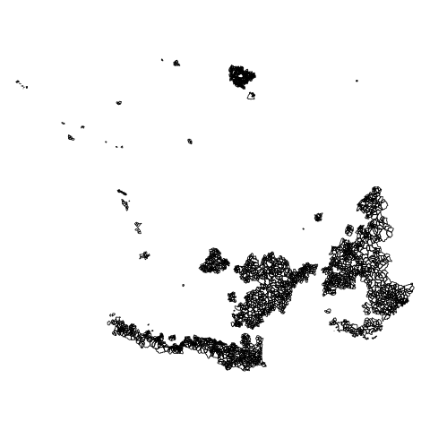

### Certaines communes appartiennent à un segment

La cartographie des communes hors segment interpelle, particulièrement au niveau
de l'estuaire de la Gironde.


```{r}
sizes <-
      getFigDim(
        x = comEstuaire,
        width = 600,
        mar = c(0, 0, 0, 0),
        res = 96
      )
png("../img/comEstuaire.png", width = sizes [1], height = sizes [2], res = 96)
par(mar = c(0,0,0,0))
ghostLayer(comEstuaire, bg = "lightblue")
plot(segment, col = "gold", add = TRUE)
plot(dataDiff, col = "green", add = TRUE)
comEstuairePb <- st_read("../dataS/segment.gpkg", "comEstuairePb", quiet = TRUE)
plot(comEstuairePb, col = "red", add = TRUE)
dev.off()
```


### Sauvegarde des communes hors segment et des faux
```{r}
dataDiff$libgeo <- "Hors segment"
dataDiff$codgeo <- "00"
dataDiff$libgeo [dataDiff$NOM_DEP == "GIRONDE" & dataDiff$INSEE_COM %in% comEstuaire$INSEE_COM] <- "MEDOC"
dataDiff$libgeo [dataDiff$NOM_DEP == "CHARENTE-MARITIME" & dataDiff$INSEE_COM %in% comEstuaire$INSEE_COM] <- "CHAMPAGNES" <- "CHAMPAGNES"
dataDiff$pct <- 0
dataDiff <- dataDiff[,col]
# verif doublon
length(dataDiff$INSEE_COM)
# on rajoutera le dataDiff à la table principale avec la mention 00 et "hors segment"
st_write(dataDiff, "../dataS/segment.gpkg", "communeHorsSegment", quiet = TRUE, delete_layer = TRUE  )
commune <- commune [!(commune$INSEE_COM %in% diff), colCommune]
# Sur les communes non inclues strictement dans les segments, 13 375 communes appartiennent aux segments,  3303 exclues
```

A priori, il y aurait d'autres faux, mais seul un examen attentif de la carte pour
les détecter. 

Par ailleurs, on peut s'interroger sur la pertinence de créer ces segments vides, notamment
sur les espaces urbains (mais pas tous). De toutes façons, il n'y aura jamais de 
culture sur ces espaces.


## Les communes divisées sur plusieurs segments (st_intersection)

Afin de détecter les communes divisées sur plusieurs communes dans les communes restantes
(13 375), on génère les intersections (table partie).


```{r}
partie <- st_intersection(commune, segment)
partie$pct <- NA
partie <- partie [, col]
```

26 276 morceaux pour 13 375 communes. toutes les communes en 2 morceaux ?


### Dénombrer les parties des communes

```{r}
tab <- table(partie$INSEE_COM)
table(tab)
max(tab)
# représentation graphique
par(mar = c(4,4,4,2))
barplot(sort(tab), las = 2, xlab = "communes", ylab = "nb de parties", names.arg = NA,
        main = paste0(length(tab), " communes représentées entre 1 et 5 fois"))
```

### Un exemple de problème topologique : la commune partagée en 5 parties

```{r}
id <- names(tab) [tab == 5]
sel <- partie [partie$INSEE_COM == id,]
png("../img/commune5.png")
par(mar = c(0,0,1.2,0))
ghostLayer(sel)
plot(segment, col = "gold", add = TRUE)
typoLayer(sel, var = "codgeo", add = TRUE)
layoutLayer(title = "Une commune divisée en 5 morceaux")
dev.off()
par(mfrow = c(2,3))
for (i in 1:5) { plot (sel$geom [i])}
# une piste : taille des intersections ?
taille <- sapply(sel$geom, st_area)/10000
plot(taille, main = "5 parties intersectées : une seule zone", xlab = "identifiant partie",
    ylab = "aire (hac)" )
```


Cet exemple souligne les problèmes topologiques. Mais on ne peut pas encore utiliser
la technique du centroide puisqu'il y a des communes qui chevauchent réellement les
segments.

### Base des parties de commune

Les communes sont représentées entre 1 et 5 fois. On étudie les uniques représentations
à part. S'agit-il des communes limitrophes ?
C'est à partir de la table des représentations entre 2 et 5 fois que l'on pourra 
extraire les communes qui intersectent plusieurs segments.

#### Méthode

- on extrait la fréquence, 
* on représente barplot,
- et on filtre la base des communes sélectionnées

point de vigilance : attention à travailler avec le code unique commune ! (code INSEE)

Comme on répète l'opération sur deux jeux de communes, on utilise la fonction *filtrerParties*.

```{r}
filtrerParties <- function (nbPartiesMin, nbPartiesMax) {
  # nbPartiesMin <- 0
  # nbPartiesMax <- 1
  code <- names(tab) [tab >= nbPartiesMin & tab <= nbPartiesMax]
  par(mar = c(8, 4, 4, 4))
  tabSel <- tab  [tab >= nbPartiesMin & tab <= nbPartiesMax]
  barplot(
    sort(tabSel), xlab = "identifiant partie", names.arg = NA,
    las = 2,
    main = paste0(
      length(tabSel),
      " communes représentées entre ",
      nbPartiesMin,
      " et ",
      nbPartiesMax,
      "  fois"
    )
  )
  data <- partie [partie$INSEE_COM %in% code, ]
  }
```


#### Une seule partie ? Impossible !

Pourquoi ces géométries ne sont pas inclues dans les communes inscrites dans les segments ? S'agit-il 
des communes limitrophes ?

```{r}
dataUnePartie <- filtrerParties(0,1)
sizes <-
      getFigDim(
        x = comEstuaire,
        width = 600,
        mar = c(0, 0, 0, 0),
        res = 96
      )
png("../img/comUnePartie.png", width = sizes [1], height = sizes [2], res = 96)
par(mar = c(0,0,0,0))
ghostLayer(comEstuaire, bg = "lightblue")
plot(segment, col = "gold", add = TRUE)
plot(dataUnePartie, col = "green", add = TRUE)
dev.off()
dataUnePartie$pct <- 100
```


Il s'agit principalement des communes de littoral ne touchant pas de limites de segment.
1620 communes sont concernées.

#### Entre deux et cinq parties

```{r}
partie <- filtrerParties(2,5)
commune <- commune [commune$INSEE_COM %in% unique(partie$INSEE_COM),]
# 11 755 communes concernées / 24 656 parties
```

### Calcul des aires pour éliminer les problèmes d'ordre topologiques

#### Calcul aires de la commune et des parties de la communes, filtrage des petites aires.

```{r}
# aire des communes et de leurs parties
partie$aire <- sapply(partie$geom, st_area)/10000
commune$aire <- sapply(commune$geom, st_area)/10000
# Elimination des toutes petites taills < 15 hac
plot(commune$aire)
partie <-  partie [partie$aire > 15,]
length(unique(partie$INSEE_COM))
# Si on supprime les parties inférieures à 15 hac, on garde la même quantité de commune.
```

#### Calcul des rapports entre les aires respectives


```{r}
nb <- nrow(partie)
i <- 1
for (i in 1:nb) {
  id <- partie$INSEE_COM [i]
  total <- commune$aire [commune$INSEE_COM == id]
  partie$pct [i] <- round((partie$aire [i] / total) * 100,0)
}
plot(partie$pct)
barplot(table(partie$pct))
```

On observe une concentration des petites et grosses aires pour les parties.


#### Recherche des vraies anomalies

A l'examen du graphique, on part sur l'idée que les parties inférieures à 15 %
de l'aire et supérieures à 90 % sont des débordements topologiques.
Cela génère 113 parties correspondant à 35 communes. On cartographie
ces 35 communes.

```{r}
partieAnomalie <- partie [partie$pct > 15 & partie$pct < 90 ,]
tab <- table(partieAnomalie$INSEE_COM)
# On élimine les communes présentes une seul fois
comAnomalie <- names(tab)[tab > 1]
nb <- length(comAnomalie)
i <- 1
for (i in 1:nb) {
  g <- commune$geom [commune$INSEE_COM == comAnomalie [i]]
  partieSel <- partie [partie$INSEE_COM == comAnomalie [i],]
  sizes <-
    getFigDim(
      x = g,
      width = 300,
      mar = c(0, 0, 1.2, 0),
      res = 96
    )
  png(
    paste0("../img/anomalies_", i, ".png"),
    width = 300,
    height = sizes [2],
    res = 96
  )
  par(mar = c(0, 0, 1.2, 0))
  plot(g, bg = "antiquewhite1")
  segSel <-
    st_intersection(segment, g)
  noms <- unique(segSel$libgeo)
  segmentSel <- segment [segment$libgeo %in% noms,]
  typoLayer(segmentSel, var = "libgeo", add = TRUE)
  plot(
    partieSel$geom,
                 lwd = 2,
                 border = "red",
                 add = TRUE,
                 col = NA
  )
  labelLayer(partieSel, txt = "pct", halo = TRUE)
  layoutLayer(paste0(
        "Commune de ",
    commune$NOM_COM [commune$INSEE_COM == comAnomalie [i]]))
  dev.off()
}

dataAnomalie <- partieAnomalie [partieAnomalie$INSEE_COM %in% comAnomalie, col]

```

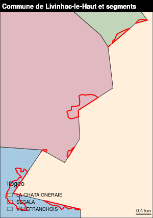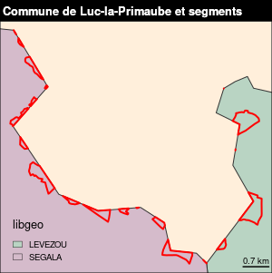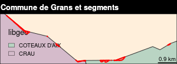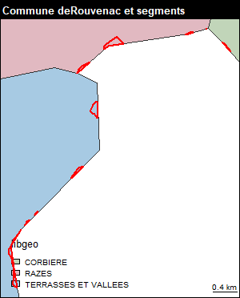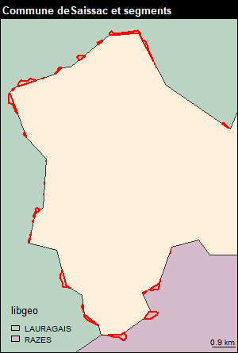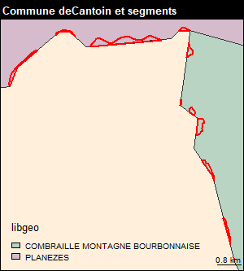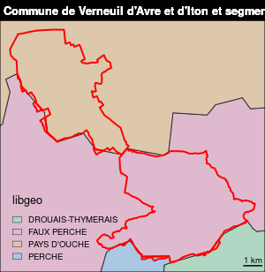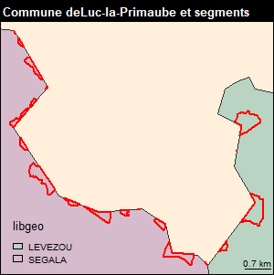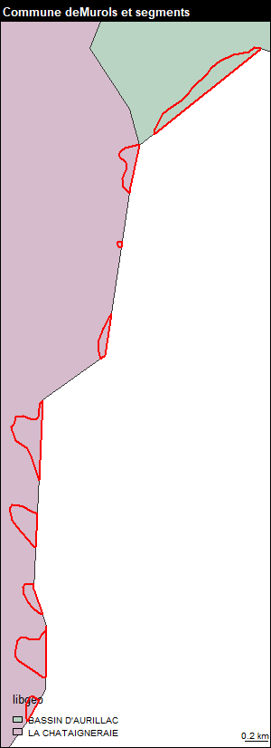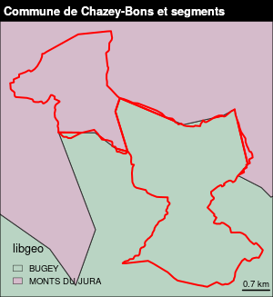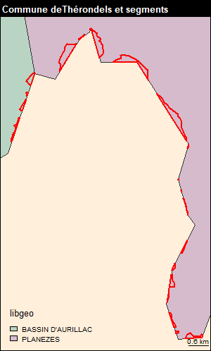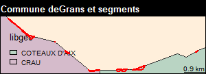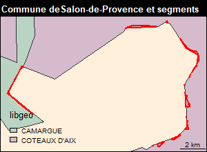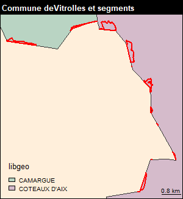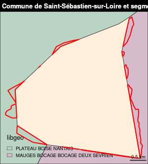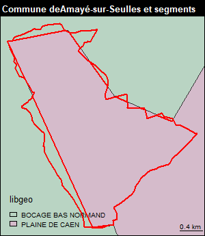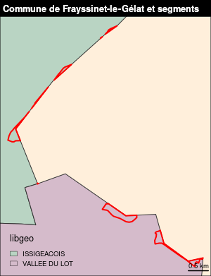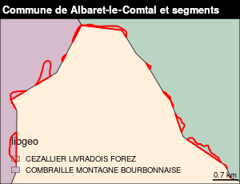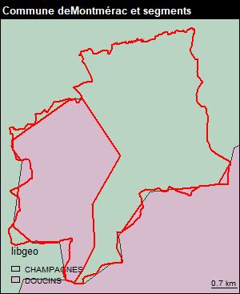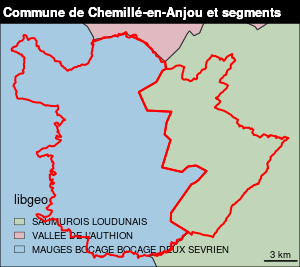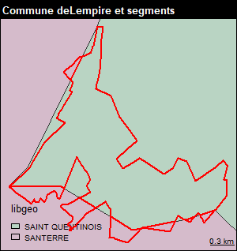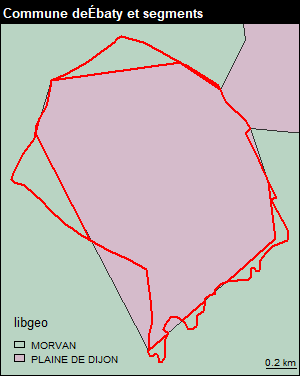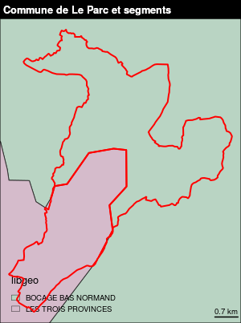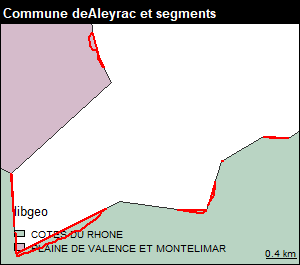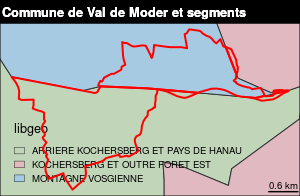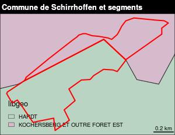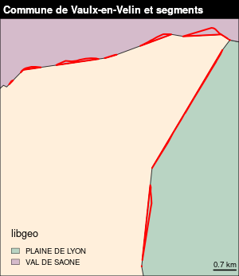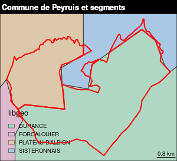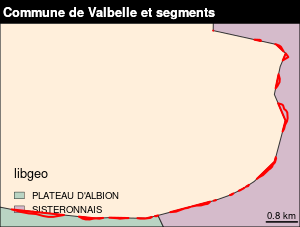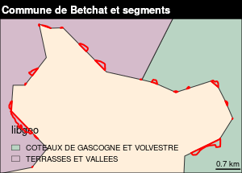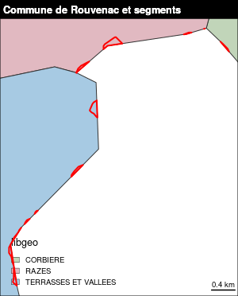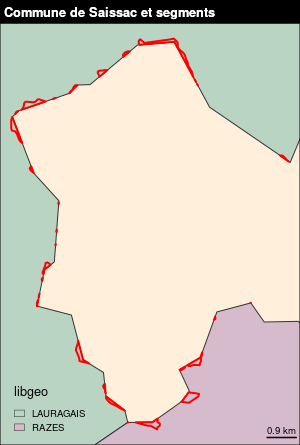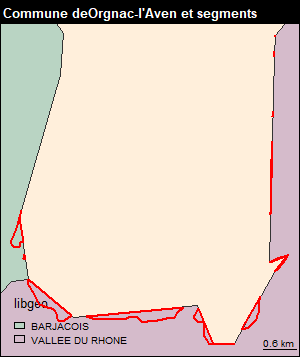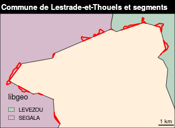


#### Les fausses anomalies

Il suffit de filtrer sur la base des 11755 communes, puis d'utiliser la technique
du centroide pour récupérer les communes qui n'ont que des problèmes de limites 
topologiques.


```{r}
commune <- commune [!(commune$INSEE_COM %in% comAnomalie),]
dataFauxAnomalie <- st_intersection(st_centroid(commune), segment)
dataFauxAnomalie$pct <- 100
dataFauxAnomalie <- dataFauxAnomalie [, col]
## 11 720 communes concernées. On retrouve les 35 communes en anomalie.
```


## Table finale

On a obtenu plusieurs tables : dataDiff, dataInclu, dataUnePartie, dataFauxAnomalie
dont le total doit faire l'ensemble des communes moins les anomalies.
Concernant les géométries, sauf pour dataAnomalie,  on reprend les géométries des communes
de départ.

### Vérification


```{r}
nrow(dataDiff) + nrow(dataInclu) +  nrow(dataUnePartie) + nrow (dataFauxAnomalie)
# 34 833 (pour mémoire 34868 communes au départ et les communes en anomalie 35)
nrow(dataAnomalie)
# 71
names(dataInclu) [6] <- "geom"
st_geometry(dataInclu) <- "geom"
data <- rbind (dataDiff, dataInclu,dataUnePartie,dataFauxAnomalie)
# géométrie commune
data <- data [, col,drop = TRUE]
commune <- st_read("../dataE/00_ADMIN/ign.gpkg", "commune", quiet = TRUE,stringsAsFactors = F)
dataFin <- merge (data [,col], commune [,c("INSEE_COM", "geom")], by ="INSEE_COM")
# 34833
data <- rbind(dataFin,dataAnomalie)
dataTxt <- data [,col]
write.csv2(dataTxt, "../dataS/segment.csv", row.names = FALSE)
datasf <- st_as_sf(data)
# enregistrement 34904
st_write(data,"../dataS/segment.gpkg", "data", quiet = TRUE, delete_layer = TRUE)
dataSansGeom <- data [, ]
```

### Cartographie

```{r}
table(data$pct, useNA = "always")
# Sélection d'une zone où se concentre les parties
dataEtrange <- st_read("../dataS/segment.gpkg", "dataNB", quiet = TRUE)
png("../img/dataEtrange.png")
par(mar = c(0,0,0,0))
ghostLayer(dataEtrange, bg = "antiquewhite1")
plot(segment$geom, col = "gold", add = TRUE)
choroLayer(dataEtrange,var = "pct", method = "geom", nclass = 5, add = TRUE)
com <- commune [commune$INSEE_COM %in% dataEtrange$INSEE_COM,]
plot(com, col = NA, border = "red", lwd = 2, add = TRUE)
labelLayer(segment, txt = "libgeo", halo = 1,add = TRUE)
dev.off()
```

Les intersections communes segment sont nombreuses sur un espace précis, celui du segment
de la vallée de l'Authion.


# Conclusion

Il y a moins de communes intersectant des segments que de communes nouvelles. En fait,
hormis la vallée de l'Authion, ces communes nouvelles n'ont pas d'importance.

Il y aurait donc un biais au niveau de la saisie des segments, différentes selon les équipes
régionales.

L'hypothèse de départ était qu'avec la fusion de 3000 communes, cela pouvait être 
important.

Cependant, malgré ce résultat décevant, ce travail permet de souligner qu'il serait nécessaire

- d'utiliser la géométrie des communes (ign) pour constituer des segments afin 
de traiter plus rapidement un lien commune-segment.

- de supprimer les segments vides qui correspondent aux espaces urbains définis selon
les choix des équipes régionales.

