```{r setup, include=FALSE}
knitr::opts_chunk$set(echo = TRUE)
knitr::opts_chunk$set(cache = TRUE)
# Passer la valeur suivante à TRUE pour reproduire les extractions.
knitr::opts_chunk$set(eval = TRUE)
knitr::opts_chunk$set(warning = FALSE)
```

# Cadre

## Objet

Récupérer le segment d'appartenance pour chaque commune.

Plusieurs explorations des données sont d'abord nécessaires (partie 1).

On traite ensuite le problème en plusieurs étapes (partie 2).

Afin de diminuer le nombre de communes traitées dans l'intersection, on repère d'abord
les communes inscrites totalement dans les segments (partie 2.1) 
(ensemble de 18 190 communes). 

Les contours des segments ne correspondent pas aux contours des communes. Pour contourner
ce problème, on utilise les centroïdes des communes et on intersecte avec les segments.

Mais, dans le cas présent, cela ne suffirait pas, car :

- certaines communes n'appartiennent à aucun segment (partie 2.1) Plus de 3 000 communes
sont concernés

- d'autres communes, les communes nouvelles (mouvement acceleré en 2016), sont coupées 
entre plusieurs segments. (partie 2.3) A priori, ce mouvement touche moins de 4 000 communes.

Il s'agit donc de repérer ces communes, de les traiter à part et d'utiliser le centroïde pour 
toutes les autres.


## Librairies et répertoire

```{r}
library(sf)
library(cartography)
```

# Données

```{r}
# communes sans la corse
commune <- st_read("../dataE/00_ADMIN/ign.gpkg", "commune", quiet = TRUE,stringsAsFactors = F)
dpt <- st_read("../dataE/00_ADMIN/ign.gpkg", "dpt", quiet = TRUE, stringsAsFactors = F)
# liste commune canton
com2020 <- read.csv("../dataE/00_ADMIN/communes2020.csv")
can2020 <- read.csv("../dataE/00_ADMIN/canton2020.csv")
# 2 fichiers de segments
segmentV11 <-  st_read("../dataS/segment.gpkg", "v11", stringsAsFactors = F)
segment <- st_read("../dataE/01_CULTURES/segments_syst_L93.shp",  stringsAsFactors = F)
```

Colonnes du fichier final

```{r}
colCommune <- c("INSEE_COM", "NOM_COM")
colSegment <- c("codgeo", "libgeo")
col <- c(colCommune, colSegment)
```

Zone spécifique d'étude : estuaire de la Gironde

Afin d'étudier les problèmes, une zone est choisie. Il s'agit de l'estuaire de la 
Gironde car, sur cette zone, les géographies des communes recouvrent l'estuaire.

```{r}
cible <- commune$geom [commune$NOM_DEP %in% c("GIRONDE","CHAMPAGNE")]
```


# Explorations (Ne pas jouer)

## Communes 2020 et communes ign

```{r, eval=FALSE}
diff <- setdiff(com2020$com, commune$INSEE_COM)
com2020 [com2020$com == "01119",]
# Corcelles a fusionné en 2016 en Champdor-Corcelles
commune[grep("Corcelles",commune$NOM_COM),]
```

La base ign est plus récente que com2020

## Communes et cantons 2020 : exploration, combien de communes fractionnées

Plus de communes officiellement fractionnées que par calcul, aie !

```{r, eval=FALSE}
# 2054 cantons en 2020 (communes nouvelles et multicantons 286)
table(can2020$typect)
# 434 communes fractionnées (les plus grosses)
# Dans le code officiel géographique, les communes multicantonnales sont codées > 79
tab <- table(com2020$can)
# 3033 communes sans code canton ?
sapply(com2020$can,nchar)
# lg vides, les communes assoicées ou déléguées n'ont pas de canton ? 3033 cas
tab [1]
df <- as.data.frame(tab [-1])
# on supprime ces 3033 cas.
df$chiffre <- as.integer(substr(df$Var1,3,4) )
df1 <- df [df$chiffre > 79,]
sum(df1$Freq) 
# 282 communes fractionnées d'après mon calcul...
```

## Segments, quelle version de fichier ? V11 ou segment ?

Peu importe. On prend la segment au final. 
Hypothèse : La version finale doit comporter les entêtes pour la mise à jour sur le site ?

```{r, eval=FALSE}
# plusieurs couches segments

str(segment)
str(segmentV11)
# pas les mêmes variables V11 moins protocolaire
egal <- st_equals(segment, segmentV11, sparse = TRUE)
# on teste la présence d'une géométrie non identique
table (sapply(egal, length))
# les 192 géométries sont identiques !
```


## Segments et cantons


Moins de 500 communes sont découpées dans les cantons et les segments sont basés sur des cantons...
Simplement il y a 192 segments. Observons déjà segment et cantons
Pour la géométrie des cantons, elle n'existe pas dans admin express, on la prend dans geofla 2015

Donc la piste canton - segment n'est pas bonne. Le travail se fait sur commune - segment.

```{r, eval=FALSE}
canton <- st_read("../dataE/00_ADMIN/CANTON.SHP")
# 2378 cantons en 2015
S_cantonSegment <- st_within(canton, segment, sparse = T)
table (sapply(S_cantonSegment, length))
# 2065 cantons ne sont pas dans les segments ...
```

## Vérification de la méthode, commune et dpt

Au passage on regarde les deux formes matrice simplifiée et matrice logique

Toutes les communes sont dans un département ! Ouf !

```{r, eval = FALSE}
S_communeDpt <-  st_within(commune, dpt, sparse = T)
M_communeDpt <-  st_within(commune, dpt, sparse = F)

S_communeDpt
M_communeDpt

str(S_communeDpt)

table(sapply(S_communeDpt,length))
# Toutes les communes sont dans un dpt
```


# Cas d'étude : segments et communes

## Les communes inscrites dans les segments

Cette étape permet de diminuer significativement le nombre de communes traitées.

C'est la fonction spatiale "within" qui permet de détecter les communes inscrites
dans un segment. Elle génère une matrice binaire (TRUE / FALSE). L'option sparse produit
un objet *sgbp*, plus facile à manipuler que la matrice binaire. Il s'agit des indices 
des communes et des segments concernés.

### Cartographie

```{r}
lindiceSegment <- st_within(commune, segment, sparse = T)
# distinguer les communes hors et dedans
vec <- sapply(lindiceSegment, length)
table(vec)
commune  <- cbind(commune, vec)
png("../img/within.png")
par(mar = c(0,0,0,0))
ghostLayer(cible, bg = "lightblue")
typoLayer(commune, border  = "antiquewhite1",var = "vec", legend.title.txt = "Exclu / Inclu", col = c("red", "green"), add = TRUE)
plot(segment, col = NA, border = "black",lwd = 2, add = TRUE)
dev.off()
```


### Données

```{r}
# recup indice communes inclues 18190
indiceCom <-  which (vec != 0)
# recup communes et segments via les indices
com <- commune[indiceCom,]
seg <- segment [unlist(lindiceSegment),]
# attribution du segment par jointure attributaire
tmpCom <- cbind (com, seg )
tmpSeg <-  seg [, colSegment, drop = TRUE] 
tmpSeg <- unique(tmpSeg)
# une commune par segment donc 18190 obs
dataInclu <- merge (tmpCom [, c("INSEE_COM", "NOM_COM","codgeo")], tmpSeg, by = "codgeo")
# 18190 communes dans segments
# filtre sur les communes problématiques, celles qui sont vides dans la liste
indiceComPb <- which(vec == 0)
commune <- commune [indiceComPb,]
```


16678 communes ne sont pas dans un segment, quasiment la moitié du total. Cet ensemble
se divise entre communes hors segments et communes sur plusieurs segments.

## Les communes hors segment

Les segments ne représentent pas une couverture exhaustive de l'espace. 
Ici, on exclue toutes les communes hors segment de la base commune.
Une méthode simple est de partir des centroides, d'intersecter et de repartir de la base
commune obtenue.

### Intersection centroid et segments

```{r}
centroid <- st_centroid(commune)
data <- st_intersection(centroid, segment)
# verif graphique sur les communes exclues
diff <- setdiff(centroid$INSEE_COM, data$INSEE_COM)
dataDiff <- commune [commune$INSEE_COM %in% diff,]
png("../img/horsSegment.png")
par(mar = c(0,0,0,0))
plot(dataDiff$geom)
dev.off()
```

### Certaines communes appartiennent à un segment

La cartographie des communes hors segment interpelle, particulièrement au niveau
de l'estuaire de la Gironde.


```{r}
sizes <-
      getFigDim(
        x = cible,
        width = 600,
        mar = c(0, 0, 0, 0),
        res = 96
      )
png("../img/comEstuaire.png", width = sizes [1], height = sizes [2], res = 96)
par(mar = c(0,0,0,0))
ghostLayer(cible, bg = "lightblue")
plot(segment, col = "gold", add = TRUE)
plot(dataDiff, col = "green", add = TRUE)
comEstuaire <- st_read("../dataS/segment.gpkg", "comEstuaire", quiet = TRUE)
plot(comEstuaire, col = "red", add = TRUE)
dev.off()
```


### Sauvegarde des communes hors segment et des faux
```{r}
dataDiff$libgeo <- "Hors segment"
dataDiff$codgeo <- "00"
dataDiff$libgeo [dataDiff$NOM_DEP == "GIRONDE" & dataDiff$INSEE_COM %in% comEstuaire$INSEE_COM] <- "MEDOC"
dataDiff$libgeo [dataDiff$NOM_DEP == "CHARENTE-MARITIME" & dataDiff$INSEE_COM %in% comEstuaire$INSEE_COM] <- "CHAMPAGNES" <- "CHAMPAGNES"
# on rajoutera le dataDiff à la table principale avec la mention 00 et "hors segment"
st_write(dataDiff, "../dataS/segment.gpkg", "communeHorsSegment", quiet = TRUE, delete_layer = TRUE  )
commune <- commune [!(commune$INSEE_COM %in% diff), c("INSEE_COM", "NOM_COM")]
# Sur les communes non inclues strictement dans les segments, 13 374 communes appartiennent aux segments,  3303 exclues
```


## Les communes divisées sur plusieurs segments (st_intersection)

```{r}
partie <- st_intersection(commune, segment)
partie <- partie [, col]
```

26 276 morceaux pour 13 375 communes. toutes les communes en 2 morceaux ?


### Dénombrer les parties des communes

```{r}
tab <- table(partie$INSEE_COM)
table(tab)
max(tab)
# représentation graphique
par(mar = c(4,4,4,2))
barplot(sort(tab), las = 2, xlab = "communes", ylab = "nb de parties", names.arg = NA,
        main = paste0(length(tab), " communes représentées entre 1 et 5 fois"))
```

### Un exemple de problème topologique : la commune partagée en 5 parties

```{r}
id <- names(tab) [tab == 5]
sel <- partie [partie$INSEE_COM == id,]
ghostLayer(sel)
plot(segment, col = "gold", add = TRUE)
typoLayer(sel, var = "codgeo", add = TRUE)
par(mfrow = c(2,3))
for (i in 1:5) { plot (sel$geom [i])}
# une piste : taille des intersections ?
taille <- sapply(sel$geom, st_area)/10000
plot(taille, main = "5 parties intersectées : une seule zone", xlab = "identifiant partie",
    ylab = "aire (hac)" )
```

Cet exemple souligne les problèmes topologiques. Mais on ne peut pas encore utiliser
la technique du centroide puisqu'il y a des communes qui chevauchent réellement les
segments.

### Base des parties de commune

#### Méthode

- on extrait la fréquence, 
* on représente barplot,
- et on filtre la base des communes sélectionnées

point de vigilance : attention à travailler avec le code unique commune ! (code INSEE)

```{r}
filtrerParties <- function (nbPartiesMin, nbPartiesMax) {
  # nbPartiesMin <- 0
  # nbPartiesMax <- 1
  code <- names(tab) [tab >= nbPartiesMin & tab <= nbPartiesMax]
  par(mar = c(8, 4, 4, 4))
  tabSel <- tab  [tab >= nbPartiesMin & tab <= nbPartiesMax]
  barplot(
    sort(tabSel), xlab = "identifiant partie", names.arg = NA,
    las = 2,
    main = paste0(
      length(tabSel),
      " communes représentées entre ",
      nbPartiesMin,
      " et ",
      nbPartiesMax,
      "  fois"
    )
  )
  data <- partie [partie$INSEE_COM %in% code, ]
  }
```


#### Une seule partie ? Impossible !

Pourquoi ces géométries ne sont pas inclues dans les communes inscrites dans les segments ?

```{r}
data <- filtrerParties(0,1)
sizes <-
      getFigDim(
        x = cible,
        width = 600,
        mar = c(0, 0, 0, 0),
        res = 96
      )
png("../img/comUnePartie.png", width = sizes [1], height = sizes [2], res = 96)
par(mar = c(0,0,0,0))
ghostLayer(cible, bg = "lightblue")
plot(segment, col = "gold", add = TRUE)
plot(data, col = "green", add = TRUE)
dev.off()

dataUnePartie <- data
```


Sans comprendre vraiment pourquoi ces communes n'ont qu'une partie et ne sont pas considérées comme
incluses.


#### Entre deux et cinq parties

```{r}
data <- filtrerParties(2,5)
comSel <- commune [commune$INSEE_COM %in% unique(data$INSEE_COM),]
# 11 755 communes concernées
```

### Calcul des aires pour éliminer les problèmes d'ordre topologiques

#### Calcul aires de la commune et des parties de la communes, filtrage des petites aires.

```{r}
# aire des communes et de leurs parties
data$aire <- sapply(data$geom, st_area)/10000
comSel$aire <- sapply(comSel$geom, st_area)/10000
# Elimination des toutes petites taills < 15 hac
plot(comSel$aire)
dataTest <- data [data$aire > 15,]
length(unique(dataTest$INSEE_COM))
# Si on supprime les parties inférieures à 15 hac, on garde la même quantité de commune.
```

#### Calcul des rapports entre les aires respectives

```{r}
# il s'agit d'obtenir les rapports entre les aires par ville
pct <- function (vecteur) {(vecteur / sum(vecteur)) * 100}
# Pour pouvoir traiter chaque ville, on éclate en liste
ldata <- split(data, data$INSEE_COM)
ldata [[1]] [,6, drop = TRUE]
nb <- length(ldata)
# l'aire est sur chaque 6e col de chacune des 46 listes
# On extrait pour toutes les listes uniquement la 6e colonne
laire <- list()
i <- 1
for (i in 1:nb) { 
  laire [[i]] <- ldata [[i]][,6, drop = TRUE]
  names (laire) [[i]] <- ldata [[i]][1,1, drop = TRUE] 
}
# on repère les communes dont les parties sont minimes par rapport au total des aires
# on cherche l'aire max
laire.pct <- lapply (laire, pct)
# on voit qu'il existe tjrs une aire principale occupant + de 90 % de la surface.
aire.pct.max <- sapply(laire.pct, max)
plot(aire.pct.max)
```

#### 3 hypothèses d'élimination des aires : 70,80,90 %


```{r, eval=FALSE}
comOK <- laire.pct.max [laire.pct.max >= 90]
# 3 hypothèses
anomalies90 <- laire.pct.max [laire.pct.max < 90]
anomalies80 <- laire.pct.max [laire.pct.max < 80]
anomalies70 <- laire.pct.max [laire.pct.max < 70]
# 71, 28 et 16 anomalies : on produit les cartos pour chacun  des cas
# afin de vérifier rapidement quelle hypothèse est la meilleure
for (j in c(70, 80, 90)) {
  #j <- 70
  anomalies <- laire.pct.max [laire.pct.max < j]
  nom.anomalies <- names(anomalies)
  plot(commune$geom [commune$INSEE_COM %in% nom.anomalies, ])
  # cartographies
  nb <- length(nom.anomalies)
  i <- 1
  for (i in 1:nb) {
    g <- commune$geom [commune$INSEE_COM == nom.anomalies [i]]
    sizes <-
      getFigDim(
        x = g,
        width = 300,
        mar = c(0, 0, 1.2, 0),
        res = 96
      )
    png(
      paste0("../img/anomalies_", j, "_", i, ".png"),
      width = 300,
      height = sizes [2],
      res = 96
    )
    par(mar = c(0, 0, 1.2, 0))
    plot(g, bg = "antiquewhite1")
    segSel <-
      st_intersection(segment, g)
    noms <- unique(segSel$libgeo)
    segmentSel <- segment [segment$libgeo %in% noms, ]
    typoLayer(segmentSel, var = "libgeo", add = TRUE)
    plot(
      data$geom [data$INSEE_COM == nom.anomalies [i]],
      lwd = 2,
      border = "red",
      add = TRUE,
      col = NA
    )
    layoutLayer(paste0(j, "_Commune de ", commune$NOM_COM [commune$INSEE_COM == nom.anomalies [i]],  " et segments"))
    dev.off()
  }
}
```

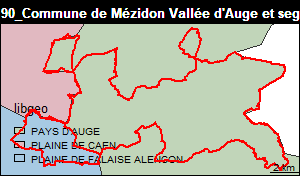
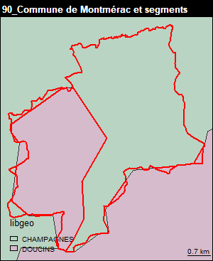
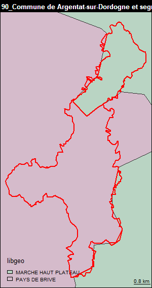
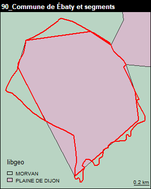
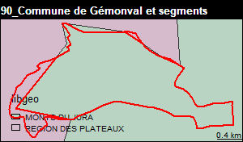

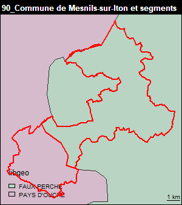
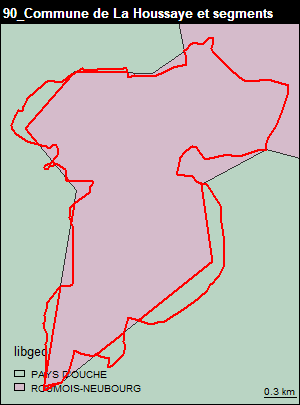
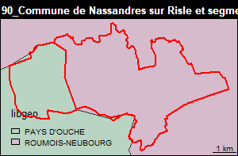
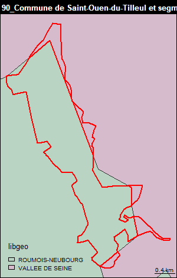
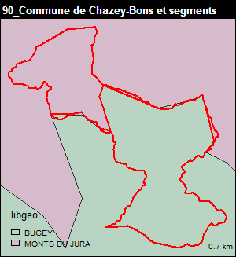
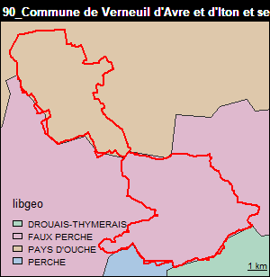
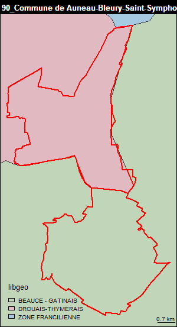
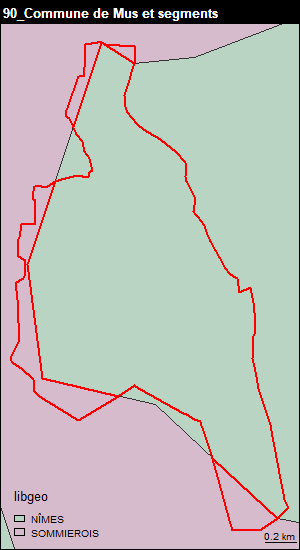
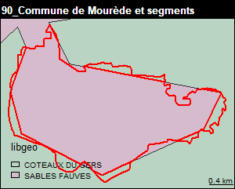
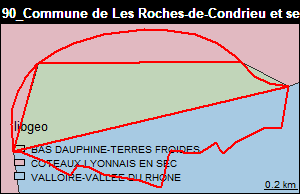
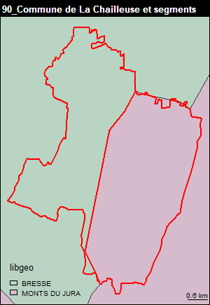
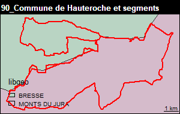
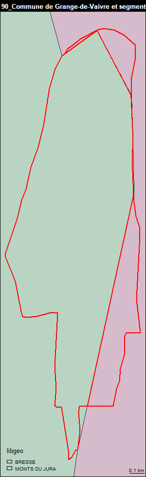
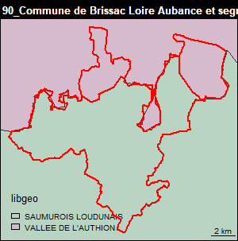

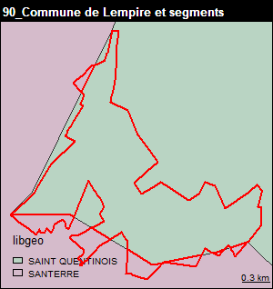
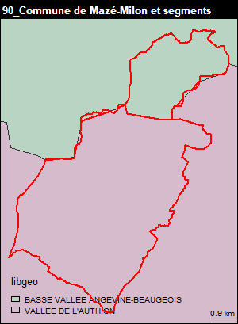
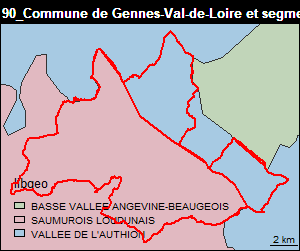
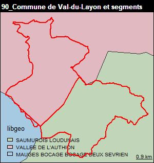
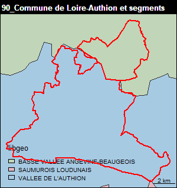
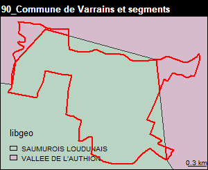
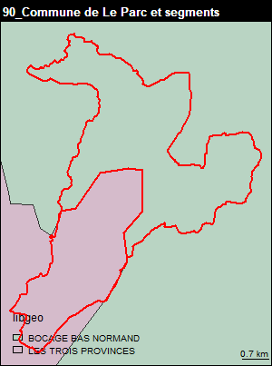
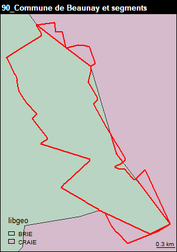
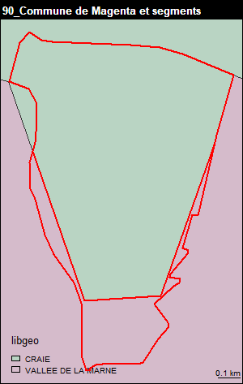
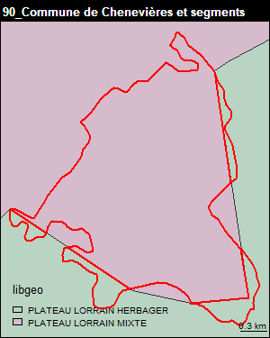
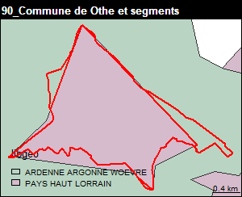
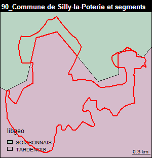
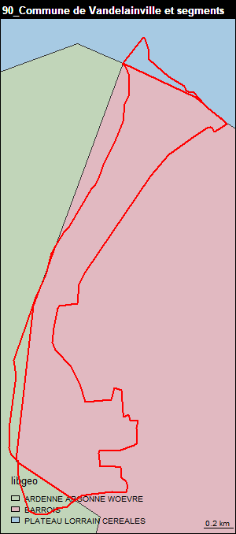

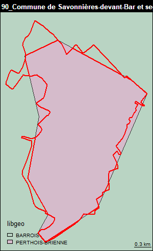
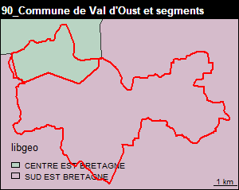
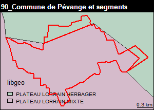
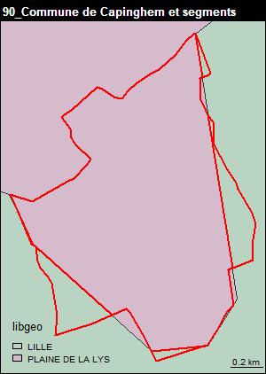
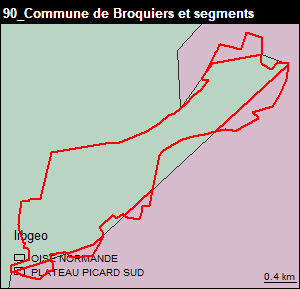
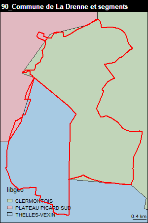
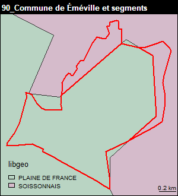

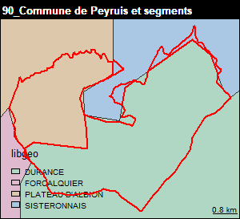
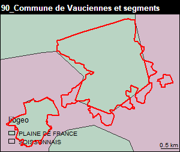
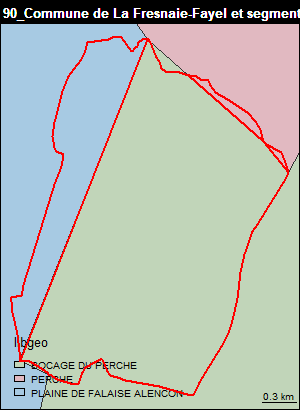
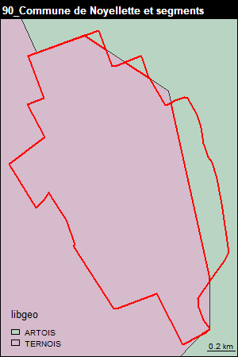
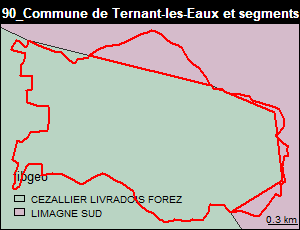
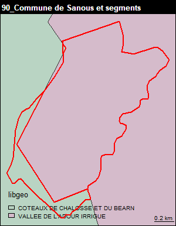
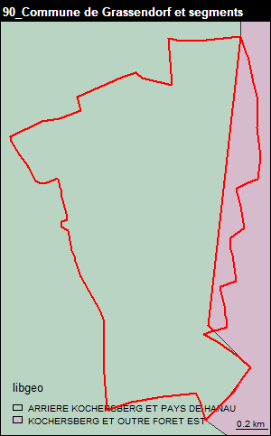
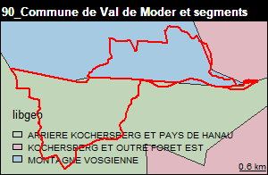
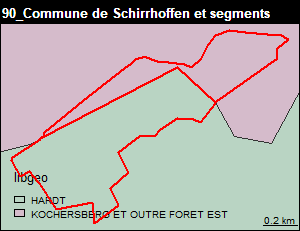
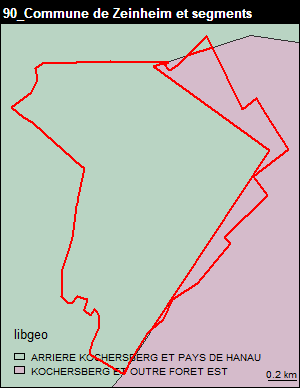
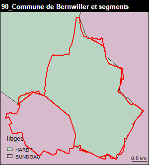


#### Extractions des centroides

Borne à 80 semble aller mieux.
Pour toutes les parties sup. à 80 on prend le centroid
pour les parties 80, centroid de chaque partie

```{r, eval=FALSE}
id <- names(laire.pct.max [laire.pct.max >= 80])
centroid <- st_centroid(commune [commune$INSEE_COM %in% id,])
dataPlus80 <- st_intersection(centroid, segment)
dataPlus80 <- dataPlus80 [,col]
#11727
anomalies80 <- laire.pct.max [laire.pct.max < 80]
id <- names(anomalies80)
# pour toutes ces communes, on prend le fichier des parties et on attribue le
# segment du centroid des parties
# pour mémoire fichier des parties
partie80 <- st_intersection(commune [commune$INSEE_COM %in% names(anomalies80),],segment)
# 70 parties pour 28 communnes
centroid <- st_centroid(partie80)
data80 <- st_intersection(centroid, segment)
data80 <- data80 [, col]
```


## Table finale

On a obtenu plusieurs tables : dataDiff, dataInclu, dataUnePartie, dataPlus80 dont le
total doit faire l'ensemble des communes moins les anomalies.
Concernant les géométries, sauf pour dataPlus80, on reprend les géométries des communes
de départ.

Vérification


```{r, eval=FALSE}
nrow(dataDiff) + nrow(dataInclu) + nrow (dataPlus80) + nrow(dataUnePartie)
nrow(data80)
```


